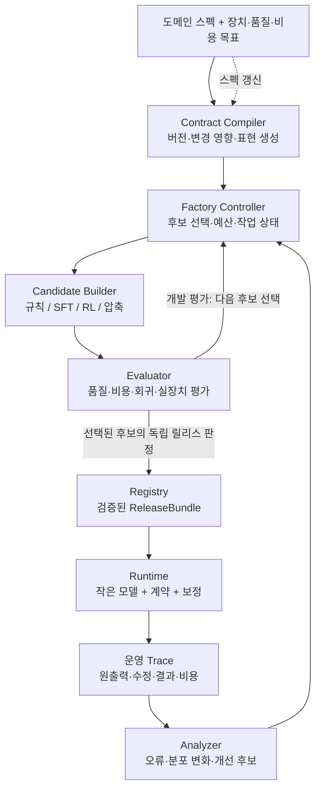
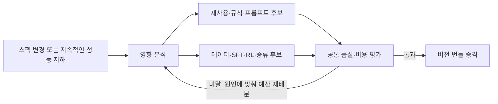
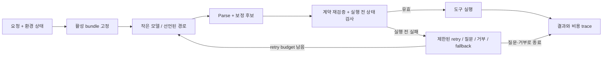

# Ganglion 지속적 특화 모델 팩토리 — 아키텍처 v2

상태: **설계 제안, 런타임 구현 전** · 2026-09-08

이 문서는 사용자가 정리한 목표를 기준으로 기존 `factory_design.md`와 `redesign_plan.md`를 발전시킨 후속 설계다. 기존 구현과 실험 기록은 보존한다. 새 아키텍처 구현 시 이 문서를 기준으로 기존 task 명세를 순차 갱신한다.

[인터랙티브 구조도](../web/architecture.html) · [독립 SVG 구조도](diagrams/factory-v2.svg)

## 1. 무엇을 만드는가

**환경 스펙과 배포 제약을 받아, 필요한 품질을 만족하는 작은 도메인 특화 모델을 생산하고, 환경이 바뀔 때 최소 비용으로 갱신하는 팩토리.**

생산 대상은 가중치 하나가 아니라 `모델 + 표현 형식 + 계약 + 보정 규칙 + 실행 정책`으로 이루어진 **ReleaseBundle**이다. 모델 크기를 줄이는 과정에서 필요한 일부 기능을 결정적 코드로 옮길 수 있고, 규칙의 복잡성이 커지면 이를 학습 데이터로 환류하여 모델에 흡수할 수 있다.

기존 세 모듈은 유지한다.

- `contract`: 도메인이 허용하는 행위와 표현의 의미를 정의한다.
- `lm`: 모델·데이터·학습·압축 후보를 만든다.
- `analyzer`: 실제 오류와 비용을 분석하고 개선 후보를 제안한다.

여기에 **factory 제어기**, **독립 평가**, **버전 저장소**, **배포 런타임**을 명시적으로 추가한다. 처음에는 한 Python 애플리케이션과 작업 프로세스로 구현한다. 이 논리적 경계가 각각 별도 서버를 뜻하지는 않는다.

## 2. 시스템의 최적화 목적

후보 구성 θ는 다음을 포함한다.

`θ = (base_model, adapter, precision, representation, schema_delivery, rules, decoding, retry/fallback_policy)`

`schema_delivery`는 전체 스키마 주입, 관련 도구 선택, 고정 스키마를 학습한 최소 프롬프트를 포함한다. 도구 선택의 누락률과 비용도 최종 시스템 평가에 포함한다. IR은 compact JSON을 기본으로 하고 native JSON, 더 짧은 DSL, 전용 토큰은 실험 후보로 둔다. 처음부터 최종 IR을 고정하지 않는다.

계획 기간 H에서:

```text
minimize  J_H(θ) = C_data + C_train + C_engineering + E[C_updates(H)]
                    + N_H × E[C_request(θ)]

subject to
  도메인 내 작업 성공률의 신뢰 하한 ≥ Q_min
  잘못된 실행률의 신뢰 상한 ≤ E_max
  거부율/해결하지 못한 요청 비율 ≤ A_max
  요청 완료 지연 p95 ≤ L_max
  실제 장치의 최대 RAM/VRAM ≤ M_max
  환경 변경 후 목표 품질 회복 시간 ≤ U_max
```

모두 거부하는 시스템이 낮은 오작동률로 통과하지 않도록 작업 성공률과 coverage를 함께 제한한다. 표본이 부족하면 `pass` 대신 `insufficient_evidence`로 판정한다. 수치와 신뢰 수준은 프로젝트별 `DeploymentProfile`에 선언한다.

토큰 수는 원인 분석 지표다. 비용 판정은 입력·출력·캐시·재시도·대체 모델 호출·컴파일 비용을 포함한다. 로컬 모델은 실제 장치의 실행 시간, peak memory, 가능하면 에너지까지 측정한다. INT4가 파라미터 수를 줄이지는 않으므로 parameter count, weight bytes, peak memory를 별도 기록한다.

금액 환산이 불확실한 사람 시간과 에너지는 숨겨서 합산하지 않고 별도 축으로 보고한다. 운영량·스펙 변경 빈도의 시나리오별 비용을 산출하고, feasible 후보의 **파레토 집합**을 보존한다. 선택 정책이 그중 운영 조건에 맞는 하나를 선택한다. 모든 후보가 제약을 어기면 예산을 더 쓰거나 더 큰 모델/다른 실행 정책을 검토하며, 품질 기준을 자동으로 낮추지 않는다.

## 3. 전체 구조



읽는 순서: **무엇을 해야 하는지 정한다 → 가장 경제적인 구현을 찾는다 → 묶어서 배포한다 → 변화와 실패를 다음 생산에 반영한다.** 개발 평가의 피드백 루프와 독립 릴리스 판정을 구분한다.

## 4. 구성 요소와 책임

| 구성 요소 | 입력 | 출력 | 결정 권한과 경계 |
|---|---|---|---|
| Contract Compiler | DomainSpec, 이전 버전, 목표 장치 | ContractBundle, ChangeSet, 영향 그래프 | 의미를 보존하는 표현 생성. 사용자 요구를 성능 개선 명목으로 완화하지 않음 |
| Factory Controller | 변경, 분석 결과, 예산, 과거 후보 | BuildPlan, Job DAG, 다음 후보, 중단 사유 | 재사용/규칙/SFT/RL/압축 선택과 예산 배분. 학습 알고리즘 구현은 소유하지 않음 |
| Candidate Builder | BuildPlan, 계약, 허용 데이터 | CandidateBundle, 학습·제작 비용 | 플러그인으로 데이터·규칙·학습·압축 수행. 자기 후보의 릴리스 승인 권한 없음 |
| Evaluator | 동결된 후보, 평가 입력, 별도 정답, 장치 | DevReport 또는 ReleaseDecision | 독립 채점. runtime에는 정답을 전달하지 않음 |
| Registry | 산출물, lineage, 판정 | 불변 번들, active pointer | 버전 조회·호환성 확인·원자적 승격. 학습·채점은 하지 않음 |
| Runtime | ReleaseBundle, 요청, 현재 환경 상태 | ActionResult, RuntimeTrace | 허용된 보정과 재시도만 수행. 요청 처리 중 학습하거나 스펙을 수정하지 않음 |
| Analyzer | 개발/운영 trace, 사용 가능한 결과 라벨 | FailureReport, DriftSignal, ImprovementProposal | 원인 가설과 개선 후보 제안. 정답 없는 실행 성공을 의미적 성공으로 취급하지 않음 |

저장소는 전 모듈이 공유하는 기반이다. 위 다이어그램의 Registry는 릴리스 경로를 강조한 것이다. 계약·데이터·후보·작업 결과도 동일한 content-addressed artifact 저장소에 남는다.

## 5. 핵심 계약과 버전

### 5.1 DomainSpec: 환경의 의미

스키마만으로 자연어 의도의 정답을 자동 생성할 수는 없다. DomainSpec은 다음을 명시한다.

- 도구 schema, 인자의 단위·기본값·별칭·사전 조건·효과·도구 호출 간 의존성.
- 입력 문맥과 런타임 상태, 지원 언어, 허용/거부/추가 질문의 조건.
- 실행 adapter, 시뮬레이터 또는 결과 확인 방법, 이용 가능한 의미 검증 능력.
- 요구 동작의 예시와 소유자가 제공한 작업 조건. 비어 있는 부분은 `unknown`으로 유지.

`ToolCallingDomain`이 첫 구현이다. 향후 다른 도메인을 추가할 때 sampler, renderer, executor, oracle 프로토콜을 구현한다. 초기부터 임의의 모든 작업을 하나의 거대한 추상 클래스로 감싸지 않는다.

### 5.2 Spec과 최적화 산출물의 분리

```text
DomainSpec@v7                  # 도메인이 요구하는 의미
  └─ ContractBundle@hash       # canonical IR, grammar, validators, lowering map
       └─ CandidateBundle     # adapter, rules, precision, decoding, schema delivery
            └─ ReleaseBundle # 정확한 모든 참조 + evidence + compatibility
```

기존 `ToolSpec.prompt_correction`처럼 사용자 문장에서 값을 추론하는 코드는 별도 `CorrectionPolicy`로 분리한다. 명시된 단위·별칭을 canonical form으로 바꾸는 것은 계약의 normalization이다. 잘못 생성한 시간을 사용자 문장에서 다시 읽는 것은 최적화 정책이다. **보정이 좋아졌다고 DomainSpec의 정답 정의가 바뀌면 안 된다.**

모든 표현은 canonical ActionPlan으로 lowering한다. IR 간 비교는 이 공통 의미에서 수행한다. 컴파일러가 표현할 수 없는 제약은 명시적으로 거부하거나 runtime validator에 남겼다고 manifest에 기록한다. 변환 정확성은 round-trip, 경계값, 독립 실행 결과로 검증한다.

### 5.3 주요 artifact

| 타입 | 필수 정보 |
|---|---|
| DeploymentProfile | target hardware/runtime, quality constraints, allowed model families, 호출량·기간, build/update budget, 선택 정책 |
| ChangeSet | old/new spec hash, 변경 symbol, compatibility, affected artifacts/cases, 보수적으로 넓혀야 하는 영향 범위 |
| DatasetManifest | 내용 hash, spec version, split, 생성 방식, label origin/quality, 원본 및 paraphrase family, 사용 가능 목적 |
| BuildPlan | parent release, recipe, 필요한 데이터, 재사용 refs, 작업 DAG, 예상 비용, budget cap, 중단 조건 |
| CandidateBundle | weights/adapter/base refs, contract, correction policy, compiler/tokenizer/runtime refs, calibration data, recipe |
| EvaluationReport | candidate hash, eval protocol/split hash, target device, 표본·신뢰 구간, raw/final 성능, 비용, 회귀 slice |
| ReleaseBundle | 검증된 candidate 참조, evidence 참조, spec compatibility, 배포 정책, 제한 조건 |
| RuntimeTrace | request id, release/spec hash, raw output, correction diff, final plan, attempts, execution outcome, state version, 비용 |
| ImprovementProposal | 적용 대상, 근거 개발 trace, 변경 종류, 기대 효과, 불확실성, 예상 비용, 독립 검증 요구 |

runtime trace에 `expected`를 넣지 않는다. 라벨은 별도 `LabelRecord(trace_id, origin, verdict, spec_version)`로 저장하며 학습/평가 권한이 있는 프로세스만 join한다. 없는 토큰·에너지 측정값은 0이 아니라 null이다.

### 5.4 예시 입력

아래는 **설정 형태를 설명하는 예시**이며 측정 성능이나 보장치가 아니다.

```yaml
domain:
  id: lab-lighting
  revision: 7
  schema: ./tools.yaml
  semantics: ./semantics.yaml
  oracle: simulator-postconditions
deployment:
  device_profile: edge-lab-a
  horizon_days: 90
  expected_requests: 1000000
  constraints:
    task_success_lower_bound: 0.98
    wrong_execution_upper_bound: 0.005
    unresolved_rate_max: 0.02
    confidence_level: 0.95
    p95_completion_ms: 300
    peak_memory_mb: 1024
    update_deadline_minutes: 120
optimization:
  allowed_steps: [reuse, rules, sft, distill, dpo, rl, quantize]
  max_build_cost_units: 100
  max_candidates: 12
  objective: lifecycle_cost
release:
  mode: canary
  regression_policy: ./regression.yaml
  incompatible_request: reject_or_route_compatible
```

## 6. 제어기: 고정 레시피에서 적응형 작업 계획으로

초기 제어기는 명시적인 결정 규칙과 제한된 후보 탐색으로 구현한다. meta-learning은 운영 기록이 충분히 쌓인 이후의 확장이다.

1. 최신 DomainSpec과 현재 release의 차이, 오류·비용 slice를 분석한다.
2. 현재 release가 새 spec과 호환되고 제약을 이미 만족하면 재사용 후보를 만든다.
3. 원인에 맞는 개선 후보를 생성한다. 후보에는 규칙 변경, 데이터 추가, adapter 갱신, 학습 방식 변경, precision/모델 크기 변경이 포함된다.
4. 영향 범위를 기준으로 필요한 artifact만 다시 만든다. 영향 분석은 최적화이며 평가 생략의 근거가 아니다.
5. 저렴한 smoke/개발 평가로 탈락시키고 유망한 후보만 더 학습·평가한다.
6. feasible 후보들의 비용·메모리·지연 파레토 집합을 갱신한다. 필요한 경우 더 작은 base로 증류하고 양자화까지 끝낸 실제 패키지를 다시 평가한다.
7. 개발 평가로 선택한 후보와 판정 절차를 동결한 뒤 독립 릴리스 평가를 요청한다.
8. 제약 만족 후보가 없거나 budget/deadline/no-improvement 조건에 도달하면 명시적인 실패·대안 보고를 남긴다. 변경된 의미와 호환되지 않는 이전 모델을 성공 후보로 취급하지 않는다.

### 6.1 후보 선택의 출발점

| 신호 | 먼저 검토할 후보 | 학습이 필요한 조건 |
|---|---|---|
| schema 표시 이름·명시적 별칭 변경 | 계약 재컴파일 + adapter 재사용 | 새 표현 때문에 의도 해석 성능이 떨어짐 |
| 단위·범위·인자 의미 변경 | 새 계약 + 데이터 재검증 + 보정 후보 | 단순 변환으로 의미 보존이 불가능하거나 평가 미달 |
| 새 도구·새 의도 | 도구 구별용 데이터 + SFT 후보 | 기존 모델 재사용 후보가 새 slice를 통과하지 못함 |
| 같은 도구를 잘못 선택 | 대조 사례, 어려운 입력, SFT/선호학습 | 레이블과 원인 분석이 충분함 |
| 장기 결과·호출 순서 문제 | 시뮬레이션 기반 RL 후보 | 신뢰할 보상과 rollout 환경이 있음 |
| 품질 여유는 있지만 장치 비용 초과 | 프롬프트/IR 축소, 양자화, 작은 base로 증류 | 더 작은 모델의 표현·의미 능력을 재학습해야 함 |

순서는 강제가 아니라 초기 탐색 휴리스틱이다. 규칙 작성 시간이 길거나 모델 의미 오류가 명확하면 곧바로 학습 후보로 간다. 이전의 변경 유형별 관측 비용이 이후 우선순위를 개선한다.

### 6.2 강화학습과 튜닝의 위치

- SFT: 올바른 행동을 빠르게 습득하는 기본 도구.
- Distillation: 더 작은 base가 교사/현재 release의 도메인 동작을 재현하도록 학습. 교사 출력의 검증 수준을 기록한다.
- DPO: 신뢰할 선호 쌍이 있을 때 사용. RL과 별도 recipe다.
- RL: 상호작용 결과 또는 의미적 성공을 채점할 수 있을 때 사용. 형식 보상만으로 의미 정확도를 주장하지 않는다.
- Quantization: 가중치 크기·실장치 비용을 줄이는 후보. 양자화 후 품질과 메모리를 다시 측정한다.

보상은 `format`, `semantic`, `execution`, `cost` 성분과 검증 근거를 따로 기록한다. 형식만 맞는 출력을 높은 의미 보상으로 승격하지 않는다. 부분 점수는 필요할 때 설계하되 연속 보상을 필수 조건으로 삼지 않는다. RL 실행은 budget·보상 신뢰도·학습 가능한 rollout 다양성 조건을 통과해야 한다.

규칙→데이터→학습→규칙 제거 후보도 지원한다. 제거 전후 성능과 총비용을 비교하여 시스템 복잡성의 무한 증가를 막는다. 복잡한 규칙을 모두 모델에 흡수해야 한다는 전제는 두지 않는다.

## 7. 두 가지 업데이트 루프



**빠른 루프**는 규칙·계약 표현·실행 설정 갱신이다. **학습 루프**는 데이터, 가중치, 모델 크기 갱신이다. 같은 evidence/gate를 사용하며 실패하면 서로 넘어갈 수 있다. 둘 다 spec 변경을 자동으로 완화하거나 해석을 몰래 바꿀 권한은 없다.

변경은 spec publisher의 버전 이벤트 또는 일정 기간 지속되는 관측 저하로 시작한다. drift trigger에는 최소 표본, 연속 window, cooldown, 변경 병합을 적용한다. 정답 없는 trace는 형식·실행 오류와 분포 변화만 말해 준다. 의미 성능 저하는 별도 라벨/시뮬레이션/표본 검토로 확인한다.

### 예: 스케줄 도구에 time_zone 필드가 추가됨

1. Compiler가 `schedule_light`와 관련 prompt/grammar/example/rule의 영향을 표시한다. 공통 토크나이저 변경처럼 영향이 큰 변경은 전체 평가로 확장한다.
2. 새 필드가 환경의 명시적 default로 결정되면 계약+정규화 갱신 후보를 먼저 평가한다.
3. 사용자 문장에서 시간대를 해석해야 한다면 시간대·시간 변환·모호한 입력의 대조 데이터를 추가한다. 기존 시간/장소/취소 사례는 replay로 유지한다.
4. reuse/rules/SFT 후보를 개발 데이터에서 비교한다. 의미 보상이 있는 시뮬레이션이 필요하면 RL 후보도 포함한다.
5. 영향 slice와 기존 도구 회귀 평가, 실제 장치 프로파일링을 수행한다. 새·기존 지원 의미에 따라 이전 데이터의 라벨을 재검증한다.
6. 선택된 정확한 bundle을 릴리스 평가 후 배포한다. 시간대 변경은 모델·규칙·스키마 버전의 원자적 전환으로 처리한다.

## 8. 평가와 학습 데이터의 경계

### 8.1 데이터 세 영역

| 영역 | 사용 | 허용되는 피드백 |
|---|---|---|
| train | SFT, RL prompts, 규칙 합성, 증류 | 레이블과 예측 사용 가능 |
| development | 후보 선택, 오류 분석, 규칙 개발 | 상세 피드백 가능. 사용한 시점부터 최종 평가로 부르지 않음 |
| release evaluation | 동결된 후보의 독립 승인 | 제어기에는 제한된 판정/집계만 전달; 정답·사례별 정보는 격리 |

원본과 paraphrase는 같은 family로 나눈다. 단순 문자열 중복 제거만으로 독립성을 주장하지 않는다. 합성 데이터는 schema-valid/semantic-checked/execution-checked의 검증 수준을 구분한다. 동일한 생성기와 검증기가 같은 오류를 공유할 수 있으므로 독립 작성 사례와 결과 기반 검증을 일부 포함한다.

고정 회귀 suite는 반복 사용 가능한 개발 자산이다. 릴리스 판정을 반복 조회하면 그 자체도 선택 누출이 생긴다. 평가 회차·후보 수·결정 규칙을 미리 고정하고, query budget을 넘기거나 실패 사례를 개발로 공개하면 해당 cohort를 소진 처리하여 다음 판정에는 새로운 cohort를 쓴다. 스펙이 바뀌면 cohort의 유효성도 다시 판정한다.

### 8.2 세 가지 검증 능력

- `StructureValidator(output, contract)`: 형식, 타입, 범위, 필수 필드.
- `RuntimeGuard(plan, state, contract)`: 현재 상태에서 실행 가능한지와 계약의 사전 조건.
- `SemanticOracle(input, output, reference_or_outcome)`: 요청을 충족했는지. 정답/환경이 없으면 `unknown`.

이 인터페이스들을 하나의 `verify() -> float`로 감추지 않는다. RewardComposer는 사용 가능한 신호만 합성한다. 최종 평가 oracle은 runtime의 입력 객체나 프로세스에 포함하지 않는다. gold로 값을 채우는 기존 BFCL 후처리는 oracle-assisted 진단 자료로만 보관하며 배포 정책으로 승격하지 않는다.

### 8.3 보고할 지표

- raw model과 최종 시스템의 정확도, 호출/거부/추가 질문 비율.
- 규칙의 rescue와 regression: 오답→정답, 정답→오답을 모두 측정.
- 새 도구·기존 도구·복합 호출·불필요 호출·부정/취소·도메인 내부 새 표현별 성능.
- 실제 backend를 통일한 baseline, SFT, RL, 규칙, IR, quantization 기여 분리.
- cold/warm 요청, 모든 retry/fallback을 포함한 end-to-end 지연·토큰·장치 메모리.
- 최초 구축 비용, 변경당 비용·사람 시간, 품질 회복 시간, 파레토 집합.

## 9. 배포 런타임



요청마다 release/spec/state version을 고정한다. 보정 전후를 모두 남기며, 보정한 plan도 다시 검증한다. no-call은 유효한 ActionPlan이다. 질문과 거부는 ToolCall이 아닌 별도 ActionResult로 모델링한다.

자동 보정은 release에 포함된 정책만 적용한다. 추론 중 새 규칙 생성·학습·계약 수정은 하지 않는다. 대체 모델이 허용되는 환경에서는 그 비용과 호출률을 시스템 제약에 포함한다. 네트워크가 없는 장치에서는 질문/거부/로컬 대안만 선택한다.

실행 전 검사에서 상태가 바뀌었으면 plan을 재확인한다. 실제 도구 호출의 idempotency는 request/action key와 실행 adapter의 보장에 의존한다. 실행 후 timeout으로 결과를 모르면 재호출하지 않고 상태 조회 또는 `unknown_outcome`으로 종료한다. 임의의 외부 API에 exactly-once를 보장한다고 가정하지 않는다.

### 9.1 승격과 롤백

`candidate → dev-qualified → release-qualified → shadow → canary → active → retired`

shadow는 출력 비교만 수행하며 실제 동작을 중복 실행하지 않는다. canary는 일부 요청을 하나의 버전으로만 실행한다. active pointer는 bundle 전체를 원자적으로 전환한다. GPU 메모리에 두 모델을 동시에 올릴 수 없는 장치는 사전 로드 대신 drain/load/health-check 절차와 필요한 중단 시간을 profile에 선언한다.

이전 bundle 롤백은 **현재 환경 스펙과 호환될 때만** 가능하다. 폐기된 도구나 바뀐 단위로 돌아갈 수 없다면 호환 release로 route하거나 해당 요청을 거부한다. 진행 중 요청은 pinned 버전으로 끝내되 폐기 권한·환경 사전 조건은 실행 직전 재확인한다.

## 10. 재현성과 작업 실행

기본 구현은 파일 기반 artifact store + SQLite metadata/job ledger + CLI orchestrator + CPU/GPU worker다. 분산 이벤트 브로커와 다중 고객 serving은 첫 버전에 필요하지 않다.

worker는 `JobSpec`을 받아 결과 artifact를 쓰고 상태 이벤트를 남긴다. 제어기는 ledger의 상태로 다음 작업을 결정한다. 외부 이벤트는 하나의 adapter가 `spec.updated`, `drift.detected`로 정규화한다. 독립 모듈의 통신 단위는 함수 내부 상태가 아니라 명시적인 입력/출력 artifact다.

```text
Job: pending → running → succeeded | failed | cancelled
Build: planned → building → dev_evaluating → selecting
       → release_evaluating → qualified | exhausted | failed
Release: qualified → shadow → canary → active | rejected
```

artifact key에는 spec, 코드, 데이터, recipe, seed, base/tokenizer/runtime 버전, target device profile을 포함한다. 동일 job key의 완료 artifact를 재사용한다. 비결정적 학습이 바이트 단위 동일하다는 뜻은 아니다. 재시도는 별도 attempt id로 남기고 최종 artifact의 실제 hash와 환경을 보관한다.

중간 결과는 임시 경로에 쓰고 완료 시 manifest와 함께 원자적으로 publish한다. 실패 작업은 예산 잔액과 retry policy에 따라 재시도한다. 동시 build가 같은 release를 덮어쓰지 않도록 spec generation과 active pointer에 compare-and-swap을 적용한다. 새 spec이 도착하면 stale build는 취소하거나 비교용으로 보관하고 승격에서는 제외한다.

## 11. 기존 코드의 재사용과 변경

| 기존 | 결정 | 이유 |
|---|---|---|
| `contract/catalog.py`, `schema_compiler.py`, `types.py` | 재사용·확장 | canonical contract와 IR 변환의 기반 |
| `ToolSpec`의 alias/default와 prompt correction | 의미 선언과 보정 정책 분리 | 정답 의미와 최적화 동작의 독립 버전 관리 |
| `lm/client.py`, `local_hf.py`, `dashscope.py` | backend adapter로 재사용 | 모델 공급자와 학습·평가 정책 분리 |
| `lm/synth/*`, `lm/finetune/sft.py` | builder 플러그인으로 재사용 | 데이터 provenance와 subset 학습 지원 추가 |
| `lm/grammar.py` | compiler artifact + backend integration으로 분리 | grammar/tokenizer/version 호환성 추적 |
| `analyzer/taxonomy.py`, `rules.py` | 재사용 | 개발/운영 evidence로 후보 제안; 실제 효과로 confidence 검증 |
| `analyzer/verifier.py` | 세 검증 인터페이스로 교체 | 구조와 의미, runtime과 학습 정답의 분리 |
| `analyzer/trace.py` | RuntimeTrace와 LabelRecord 분리 | 평가 정답이 추론 경로로 흐르는 것을 구조적으로 차단 |
| `benchmarks/*` | evaluator adapter로 재사용 | BFCL/IoT별 평가 특성을 유지; factory가 benchmark 이름에 의존하지 않음 |
| `factory.py` | 상태 기반 제어기로 교체 | 고정 threshold/max_iter 루프에서 비용·변경 기반 계획으로 전환 |
| `runs/*` | 과거 실험으로 보존 | 검증된 알고리즘만 플러그인으로 이동; gold 기반 보정은 배포에서 제외 |

목표 디렉터리의 논리적 구조:

```text
ganglion/
  contract/    # spec, compiler, IR, diff, compatibility
  lm/          # backends, synth, finetune, distill, quantize
  analyzer/    # traces, labels, taxonomy, drift, proposals
  factory/     # controller, recipes, search, jobs, budget
  evaluation/  # validators, oracle adapters, isolated runner, gates
  runtime/     # bundle loader, correction, executor, rollout
  registry/    # artifact store, manifests, lineage, active pointer
  benchmarks/  # domain-specific evaluation adapters
  cli.py
```

`factory.py`를 `factory/` 패키지로 옮길 때 import 호환 re-export와 CLI 전환을 한 번에 적용한다. 지금 폴더만 먼저 늘리지 않고 아래 단계별 기능과 함께 이동한다.

## 12. 구현 순서와 완료 조건

| 단계 | 구현 | 완료 조건 |
|---|---|---|
| A. 불변 계약·번들·독립 평가 | spec hash, manifest, RuntimeTrace/LabelRecord, 평가 입력 분리 | 같은 예측을 다른 정답으로 채점해도 runtime 출력은 불변; 저장된 trace 재채점 가능 |
| B. 한 번의 팩토리 생산 | reuse/rules/SFT builder, 비용 기록, 개발 후보 선택, bundle export | 고정 환경에서 동일 입력으로 각 후보 비교 및 재개; 목표 미달도 명시적으로 종료 |
| C. 스펙 갱신 | diff/영향 그래프, 데이터 versioning, replay, 증분 build | 도구 추가·단위 변경·도구 폐기 시나리오에서 품질 회복과 회귀·비용 측정 |
| D. 최소 사양 탐색 | base 크기, distill, precision, IR/schema delivery 후보 | 실제 장치에서 품질 제약을 만족하는 파레토 집합과 운영량별 선택 산출 |
| E. 학습·보정 적응 | reward capability에 따른 RL/DPO, 규칙 합성·흡수 | 고정 SFT/수동 규칙 대비 추가 비용당 개선을 독립 평가로 확인 |
| F. 지속 운영 | drift trigger, rollout, rollback, job budget/cooldown | 반복 스펙 변경 동안 사람 시간·업데이트 비용·장치 비용을 추적 |

RL과 압축 인터페이스는 초기에 정의하되, 실행 우선순위는 실패 원인과 장치 제약에 따라 앞당길 수 있다. 연구의 단위는 **한 도메인에서 연속된 스펙 변경을 처리하는 episode**다. 다른 도메인에 적용할 때는 각각 모델을 특화하며, 팩토리 코드 재사용률과 도메인 adapter 작성 비용을 측정한다.

## 13. 설계 결정 요약

1. 기존 세 모듈을 보존하고 독립 평가·런타임·제어기의 경계를 강화한다.
2. 요구 의미인 DomainSpec과 학습·보정 결과인 CandidateBundle을 분리한다.
3. 빠른 엔지니어링 갱신과 느린 학습 갱신을 하나의 비용·품질 선택 문제로 다룬다.
4. 모델·IR·규칙·실행 설정을 함께 버전화하고, 장치에서 측정한 결과로 선택한다.
5. 변화 없는 상태에서는 재학습하지 않는다. 변화가 생기면 재사용을 포함한 후보를 비교한다.
6. 최종 연구 성과는 최고 점수 한 개가 아니라 **스펙 변화에 따른 품질 유지 비용과 최소 배포 사양의 변화 곡선**이다.
