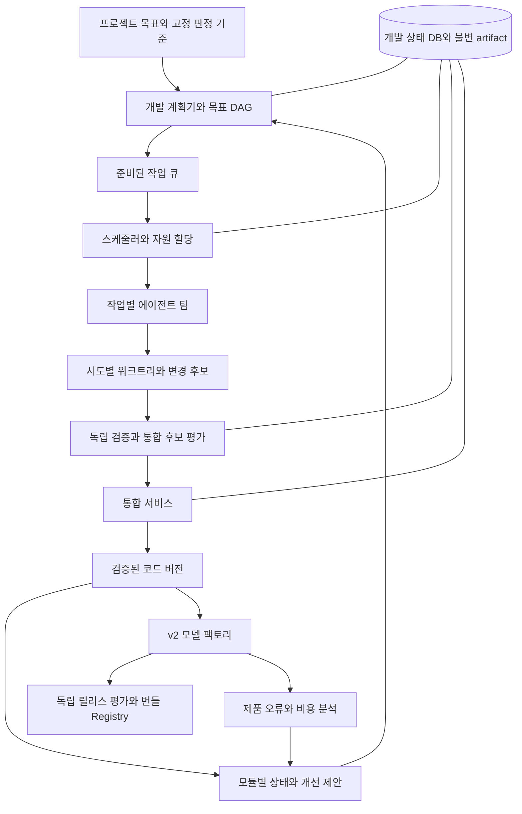

# Ganglion v2 자율개발 시스템 설계

상태: 설계 제안 · 2026-10-08 · 에이전트 실행기와 개발 제어기는 구현 전

Ganglion의 모듈과 서브모듈이 개선 과제를 발견하고, 필요한 에이전트를 할당받아 구현·검증·통합까지 수행하는 시스템을 제안한다. **모듈의 목표와 지식은 지속적으로 보관하고, 작업 팀은 필요할 때 구성하며, 검증된 변경을 프로젝트의 다음 버전으로 통합한다.** 상위 목표, 자원 한도와 판정 규칙을 고정하면 그 범위 안에서 작업 발견과 실행을 자율화할 수 있다.

기준은 [아키텍처 v2](architecture_v2.md), [작업 명세 원칙](agent-forge/task_principle.md), [워크플로 구성 원칙](agent-forge/workflow_principle.md)이다. 실행 단위의 계약은 [자율개발 복합 작업 명세](tasks/autonomous_development.md), 모듈 계층과 초기 운영 정책의 예시는 [실험 설정](autodev/experiment.example.yaml)에 둔다. 예시 설정은 설계 자료이며 현재 CLI에서 실행되지 않는다.

## 두 종류의 개선 루프

v2의 Factory Controller는 `DomainSpec → 후보 모델과 규칙 → 독립 평가 → ReleaseBundle`을 제어한다. 개발 제어기는 그 Factory를 포함한 **프로젝트 코드, 명세, 테스트와 개발 도구**를 개선한다. 코드 승격과 모델 번들 승격의 대상·권한·증거를 각각 유지한다.

| 구분 | v2 제품 팩토리 | 자율개발 제어기 |
|---|---|---|
| 입력 | 환경 스펙 변경, 도메인 오류, 장치 제약 | 프로젝트 목표, 명세와 구현의 차이, 코드 결함, 실험 결과 |
| 작업 | 규칙, 데이터, 학습, 압축 후보 제작 | 명세 정리, 코드 수정, 테스트, 실험, 인터페이스 이관 |
| 산출물 | CoreBundle 또는 ApplicationBundle | 정확한 코드 커밋과 검증 증거 |
| 판정 | 도메인 품질, 비용, 회귀와 독립 릴리스 평가 | 작업 성공 조건, 인터페이스 호환성, 코드·시스템 회귀 |
| 승격 | Registry의 활성 번들 포인터 | 개발 통합 브랜치의 코드 참조 |

제품의 Analyzer가 발견한 실패는 먼저 제품 개선 후보다. 허용된 recipe로 해결할 수 없거나 구현 결함이 확인되면 `dev.proposal.created`로 코드 개선 과제를 올린다. 개발된 코드를 적용한 모델 번들은 다시 v2의 평가를 거친다. 코드 테스트 통과로 제품 릴리스 평가를 대체하지 않는다.



계획기는 LLM의 작업 분해·가설 제안을 이용할 수 있다. 작업 승인, 할당권, 자원 예약, 상태 전이와 승격 조건은 결정적 코드가 집행한다. 에이전트는 `subtask.proposed`를 제출하며 직접 다른 에이전트를 무제한 생성하지 않는다.

## 모듈을 지속적인 개발 단위로 표현

각 모듈과 서브모듈을 `ModuleCell`로 등록한다. Cell은 프로세스가 아니라 **책임 경계, 현재 상태, 개선 대기열과 팀 구성 정책을 가진 레코드**다. 평상시 활성 에이전트가 0명이어도 지식과 목표는 남는다. 변경 신호나 예약된 탐색 회차가 생기면 관리 역할의 짧은 세션을 실행한다.

| v2 모듈 | 서브모듈 예시 | 팀이 발전시킬 대상 |
|---|---|---|
| contract | spec, compiler, representation, compatibility | 의미 선언, 컴파일, IR 변환, 변경 영향과 호환성 |
| lm | backends, data, training, compression | 모델 호출, provenance, SFT·DPO·RL, 증류·양자화 |
| analyzer | traces, labels, failures, drift, proposals | 관측, 라벨 경계, 원인 분석, 개선 가설 |
| factory | planning, search, jobs, budget | 후보 DAG, 적응형 탐색, 재개, 생산 비용 제어 |
| evaluation | protocols, oracles, development, release | 독립 채점, 평가 격리, 코드와 제품의 회귀 판정 |
| registry | artifacts, lineage, promotion | 불변 artifact, 호환성, 번들 활성 포인터 |
| runtime | interpreter, correction, rollout | 계획 해석, 보정 재검증, 배포와 롤백 |
| domains | tool_calling, pii | 도메인 계획과 의미, 도메인별 오류 분류 |
| adapters | preprocessing, execution, recovery | 선택적 문서 처리, 실행, 복원 |
| benchmarks | iot, bfcl, pii | 도메인별 실증과 비교 어댑터 |
| operator | console, ctl, web, programs | 운영 UI, CLI, 애플리케이션 runner |
| devsystem | planning, scheduling, ledger, workspace, validation, integration | 자율개발 시스템 자체의 후보 개선 |

현재 존재하는 파일과 v2가 제안하는 경로는 등록부에서 구분한다. 논리적 Cell을 추가하기 위해 제품 코드를 먼저 폴더별로 이관하지 않는다. 특히 현재 `ganglion/factory.py`를 `factory/`로 옮기는 일은 import 호환성과 CLI를 함께 검증하는 별도 작업이다. `lm/registry.py`의 모델 공급자 등록부와 v2 Release Registry도 서로 다른 책임이다.

`ModuleSpec`은 id, parent, 현재·계획 경로, 소유하는 symbol과 문서, 제공·소비 계약, 의존 Cell, 허용 변경 범위, 필수 gate, 자원 종류와 최대 동시 세션을 담는다. 파일 소유권은 가장 구체적인 서브모듈로 결정하고, 같은 우선순위의 중복 소유권은 등록 오류로 처리한다. 단순 import 관계와 의미·artifact 의존 관계를 함께 기록한다.

모듈 기억은 버전이 붙은 명세, 설계 결정, 검증된 인터페이스, 미해결 문제, 실패한 후보와 그 증거 참조로 구성한다. 에이전트의 요약은 검색 보조 자료다. 최신 커밋·계약·실험 artifact를 확인한 사실을 대신하지 않는다.

세션마다 ContextBuilder가 목표와 ModuleSpec revision, 코드 snapshot, 관련 파일·제공 API, 허용된 evidence와 최근 실패를 `ContextPacket`으로 묶는다. 전체 대화 이력을 매번 전달하지 않는다. 라벨의 train/development/release 구역과 역할별 접근 권한을 packet 생성에도 적용한다. 세션 교체 시 새 에이전트는 이 packet과 저장된 patch에서 이어가며, Cell 지식의 갱신은 검증된 artifact 참조를 통해 수행한다.

## 모듈 내부 팀과 모듈 사이 협업

팀은 작업의 성격에 따라 다음 역할을 조합한다. 한 역할은 여러 세션으로 늘릴 수 있고, 한 에이전트가 시점에 따라 다른 모듈로 이동할 수 있다.

| 역할 | 책임 | 제출하는 artifact |
|---|---|---|
| steward | 명세 차이와 관측에서 과제를 제안하고 Cell 지식을 갱신 | 근거를 연결한 Proposal, 상태 snapshot |
| implementer | 지정된 범위에서 구현 | patch, 변경 파일·symbol 목록, 자체 확인 결과 |
| explorer | 독립 대안, 재현 사례, 실패 원인 탐색 | 대안 patch 또는 재현 입력·실험 결과 |
| verifier | 고정 성공 조건과 반례에 따라 검증 | candidate hash에 묶인 VerificationReport |
| integrator | 통합 후보 구성과 참조 승격 | IntegrationRecord, 정확한 통합 커밋 |

일반 작업은 구현자와 검증자를 시차를 두고 할당한다. 독립 하위 작업이면 구현자를 늘리고, 원인이 불명확하면 구현자와 탐색자를 함께 배치한다. 대안 구현은 같은 파일을 수정하더라도 서로 다른 후보 워크트리에서 진행할 수 있다. 팀 내부의 메시지와 동료 의견은 도움 자료이며 변경 채택은 검증 artifact로 판정한다.

Cell 사이에는 `ContractChangeProposal`을 전달한다. 여기에는 이전·새 계약 hash, 의미 차이, 영향을 받는 생산자·소비자, 이관 순서와 검증 조건이 들어간다. 소비자는 수용 조건이나 반례를 제출한다. 합의한 인터페이스를 동결한 뒤 구현 과제를 배분한다. 계약 의견이 충돌하면 고정 명세와 재현 가능한 증거로 판정하고, 의미가 정의되지 않은 부분은 목표 소유자에게 질의한다.

예를 들어 TextEditPlan 표현 변경은 `domains.pii`, `runtime.interpreter`, `adapters.execution`의 연결 작업이다. 호환 계층을 먼저 넣을 수 있으면 단계적으로 통합한다. 호환 계층을 만들 수 없으면 하나의 `ChangeGroup`으로 묶어 전체 변경 조합을 통과시킨다. 그래프의 순환 의존은 이처럼 공동 변경 단위로 축약하고, 내부 작업에는 별도의 실행 DAG를 둔다.

## 자율적으로 다음 작업을 발견하는 방식

프로젝트 목표를 `Goal → Milestone → Proposal → Task`로 연결한다. 처음에는 v2의 A–F 단계가 상위 Milestone이 된다. Cell은 테스트 실패, 계약 변경, 운영 오류, 비용 초과, 목표에서 요구한 미구현 기능과 주기적인 제한 탐색을 제안 근거로 사용한다.

제안은 대상 Cell, 근거 artifact, 상위 목표, 확인 가능한 문제, 변경 가설, 성공 판정, 예상 비용, 의존성과 불확실성을 포함한다. 같은 원인·목표·입력 버전의 제안은 중복 제거한다. 이미 실패한 접근을 다시 제안하려면 새로운 입력이나 가설을 명시해야 한다.

계획기는 상위 목표에 기여하는 제안을 작업 DAG로 만든다. 모듈마다 독자적인 기능을 계속 만드는 행동을 막기 위해 모든 작업은 목표 연결이나 제한된 탐색 예산을 가져야 한다. 테스트 개수, 코드 줄 수, 에이전트의 자체 점수는 프로젝트 진척의 목적함수가 아니다.

초기 배분은 고정 휴리스틱으로 시작한다. 예를 들어 가용 자원의 대부분은 준비된 목표 작업에 쓰고 일부만 새로운 가설에 배정한다. 이 비율은 프로젝트 정책으로 고정하며 실험에서 조정한다. 근거 없는 제안이 반복되거나 개선이 없으면 해당 탐색을 cooldown하고 원인을 기록한다. 준비된 과제가 없으면 대기한다.

## 동적 할당과 자원 제어

할당 대상은 모듈 전체가 아니라 **특정 입력 버전에 대한 작업의 역할 세션**이다. 준비 여부는 선행 artifact의 완료, 입력 계약의 유효성, 성공 조건의 확정과 자원 예약 가능성으로 결정한다.

준비된 작업의 우선순위는 다음과 같은 초기 휴리스틱으로 계산한다. 모든 항은 같은 범위로 정규화하고 계수는 정책 버전에 고정한다. 개선 가설은 측정 전까지 불확실한 추정값으로 유지한다.

```text
priority(task) = milestone_value + dependency_unblock + queue_age
                 + evidence_strength + exploration_allowance
                 - estimated_cost - integration_risk
```

CPU, 메모리, GPU 장치 lease, 모델 API 동시 호출, 입력·출력 토큰, wall time과 검증 슬롯을 함께 제한한다. 계획·steward·탐색·실패·재검증 비용도 총예산에 포함한다. 검증 backlog가 길어지면 구현자 증가를 멈추고 검증에 자원을 먼저 배분한다. GPU 학습 대기에는 코딩 에이전트를 계속 붙여 두지 않는다.

추가 에이전트는 독립적인 하위 작업이 있고 추가 비용에 비해 병목 해소가 예상될 때 배정한다. 공유 symbol을 동시에 바꾸거나 순차 추론이 필요한 작업은 팀을 늘려도 처리량이 좋아지지 않을 수 있다. 관련 연구도 협업 성과가 작업 구조에 따라 달라짐을 보고한다. 이 연구는 Ganglion 개발 작업의 실측 결과가 아니므로, 할당 전략은 별도의 비교 실험으로 확인한다. [Towards a Science of Scaling Agent Systems v3](https://arxiv.org/abs/2512.08296v3)

재할당은 artifact가 저장된 경계에서 수행한다. 작업 중인 세션을 옮길 때 patch, 로그와 미완료 체크리스트를 보존하고 새 attempt를 만든다. 검증은 작성자 세션과 분리하고, 초기에는 작성자 세션 종료 후 검증자를 시작해 동시 세션 낭비를 줄인다. 동일 모델의 두 세션만으로 판정 독립성을 주장하지 않으며, 별도 과정에서 관리한 평가 입력과 결정적 실행 검증을 중심에 둔다.

모듈별 활성 세션 상한은 부모 Cell의 상한과 전역 상한을 함께 소비한다. 나이가 든 준비 작업에는 가산점을 주되 모든 선행 작업이 충족되어야 한다. 신규 에이전트가 필요하면 스케줄러의 WorkerPool adapter가 세션을 생성한다. 초기에는 제공자별 복잡한 자동 모델 선택을 생략하고 capability와 비용 등급으로 배정한다.

## 작업 계약과 상태

| 레코드 | 주요 필드 |
|---|---|
| ProjectObjective | objective revision, Milestone DAG, 고정 성공 기준, 종료 조건 |
| ModuleSpec | 책임과 소유 경로, 계약 의존성, gate, 팀 상한 |
| Proposal | 문제 근거, 목표, 가설, 기대 효과·비용·불확실성 |
| TaskSpec | inputs, outputs, read/write scope, dependencies, acceptance, budget cap |
| ContextPacket | objective·module·code revisions, 허용된 evidence, 인터페이스와 작업 범위 |
| Attempt | task revision, candidate id, role slot, agent profile, attempt id, base SHA, 작업 공간, deadline |
| Lease | task·candidate·role slot, attempt id, fencing token, holder, expiry, 예약 자원 |
| ChangeSet | parent SHA, candidate SHA, diff hash, 실제 변경 scope, 변경 계약 |
| VerificationReport | candidate·test·policy hashes, 실행 환경, 판정, 로그와 측정값 |
| IntegrationRecord | expected target SHA, 통합 후보 SHA, 검증 refs, 승격 상태 |

TaskSpec은 기존 task 문서의 `Role / Scope / Procedure / Contract / Observation`을 실행 데이터로 투영한다. 명세의 자연어 맥락은 남기되, scope와 성공 조건은 경로·symbol·명령 profile·metric predicate 등 기계적으로 검사 가능한 필드로도 선언한다. 후보 코드가 임의로 만든 shell 문자열을 검증 서비스의 특권으로 실행하지 않는다.

Task는 원하는 결과를 표현하고 실제 할당은 역할 slot에서 일어난다. 병렬 대안은 서로 다른 candidate id를 가지며 `(task revision, candidate id, role slot)`마다 하나의 현재 attempt와 lease를 둔다. 재시도는 해당 slot의 fencing token만 증가시켜 다른 정상 후보를 무효화하지 않는다. 파일을 만드는 탐색 작업은 별도 자식 Task로 분리하고, verification은 제출된 SHA를 입력으로 하는 독립 Job이다. 채택 후보가 통합되면 나머지 후보는 취소하며 모든 후보·자식 작업의 비용을 부모 예산에서도 차감한다.

```text
Proposal: proposed → triaged → accepted | rejected | deferred
Task:     blocked → ready → active → submitted → verifying
          → integrating → completed | exhausted | cancelled | superseded
Attempt:  leased → running → submitted | failed | cancelled | expired
Verify:   pending → running → passed | failed | insufficient_evidence
Integrate: planned → prepared → verified → committed | stale | rejected
```

검증 실패는 기존 attempt를 성공으로 바꾸지 않는다. 예산·수정 회차가 남으면 실패 근거를 입력으로 새 attempt를 생성한다. 입력 계약이 바뀌면 작업을 `superseded`하거나 새 revision으로 재계획한다. 병목이나 미정 의미로 진행할 수 없는 작업은 원인과 필요한 조건을 갖고 `blocked`에 남긴다. 완료는 통합된 코드에서 acceptance가 만족된 상태다.

## 워크트리와 실행 환경

워크트리는 `task_id / candidate_id / attempt_id`마다 만든다. 워크트리마다 writer는 하나이며 다른 세션은 patch나 read-only artifact로 협업한다. 테스트·탐색 세션도 자신이 수정할 파일이 있으면 별도 작업 공간을 쓴다. mutable venv, 임시 파일, DB, run 경로와 로그를 attempt별로 분리하고 데이터와 모델 cache만 읽기 전용으로 공유한다.

Git worktree는 파일과 index를 나누지만 repository refs 등은 공유한다. 따라서 워크트리만으로 에이전트의 실행 권한이 격리되지는 않는다. [Git worktree 공식 문서](https://git-scm.com/docs/git-worktree)

실행 단계에서는 WorkspaceService가 worktree 생성, patch 수집과 커밋을 담당한다. worker에 제공하는 mount에서는 Git 관리 경로와 공통 repository metadata를 쓰기 금지하고, 모델·데이터 접근과 허용된 도구만 노출한다. 초기 격리는 단일 호스트의 작업 프로세스와 파일 경계로 시작할 수 있지만, 자유로운 shell을 허용하는 단계에서는 container 또는 동등한 실행 경계가 필요하다. 정책은 worker의 자기 신고가 아니라 gateway·mount·프로세스 제어로 집행한다.

patch를 수집할 때 생성·삭제·rename·symlink와 테스트·설정 변경을 포함해 실제 scope를 검사한다. 범위를 벗어난 필요가 발견되면 scope 확장 제안이나 담당 Cell의 작업을 만들고 기존 scope의 patch로 몰래 포함하지 않는다. 일반 기능 작업이 테스트를 추가할 수는 있으나, 판정 서비스가 관리하는 고정 gate를 제거하거나 기준을 바꾸지 못한다.

## 검증과 코드 통합

검증은 단계적으로 실행하되 프로젝트에서 의무로 지정한 gate는 생략하지 않는다.

1. 실제 변경 scope, artifact integrity, 계약·입력 revision과 비용 한도를 검사한다.
2. 작업 성공 조건, 모듈 테스트, 반례와 제공·소비 계약의 검사를 수행한다.
3. 변경 영향 그래프에서 소비자 테스트와 회귀 범위를 선택한다. 영향 정보가 불완전하면 범위를 넓힌다.
4. 후보를 최신 통합 브랜치 위에 합성해 정확한 통합 커밋을 만든다.
5. 그 커밋에서 필수 시스템 회귀와 독립 검증을 완료한다.
6. 통합 브랜치가 검증한 이전 SHA를 가리킬 때만 해당 커밋으로 승격한다.

MergeQueue는 초기에는 하나의 통합 슬롯으로 운영한다. Git 충돌 해결, cherry-pick 또는 rebase가 코드를 바꾸면 이전 보고서를 그대로 쓰지 않고 새 SHA에서 gate를 다시 실행한다. read-set의 제공 계약 변경도 재검증 사유다. branch 참조는 compare-and-swap으로 갱신한다. `ChangeGroup`은 모든 필수 구성원과 조합 검증이 끝나야 승격된다.

판정 입력은 작업 시작 시 동결한다. 구현자에게 공개하는 개발 테스트와 독립 판정 입력을 구분하고, 판정 입력은 verifier 내부에서만 사용한다. 자세한 실패 입력을 개발에 공개하면 그 사례는 개발 자산으로 전환하고 이후 독립 판정에서 교체한다. release evaluation의 정답·cohort는 v2의 기존 격리와 조회 예산을 유지한다. evaluation 모듈을 개발하는 에이전트도 실제 독립 정답 대신 개발용 fixture로 구현한다.

독립 검증에서도 후보 프로그램에는 요청 입력만 전달하고 기대 정답은 별도 oracle 프로세스가 비교한다. 후보 실행 환경에 oracle 파일·평가 credential·정답 DB를 mount하지 않는다. verifier가 후보 코드를 import한 동일 프로세스에 숨겨진 정답까지 넣으면 실행 세션을 나누어도 정답 경계가 무너진다. 공개 단위 테스트와 별도의 독립 판정 입력은 각각의 목적에 맞게 운영한다.

초기에는 정책으로 지정한 연구용 통합 브랜치에 자동 승격한다. main, 원격 push와 제품 배포는 각각 별도 권한이다. 반복 작업마다 확인을 요구하는 대신 처음 선언한 운영 정책의 범위에서 진행한다. 목표 의미, 품질 하한, 예산 한도, 독립 판정 정책을 바꾸는 행위는 일반 작업 권한으로 수행하지 않는다.

코드 rollback과 번들 rollback은 각각 현재 계약과 데이터·상태 호환성을 확인한다. 비호환 마이그레이션이 있으면 이전 커밋으로 되돌리는 것만으로 복구를 선언하지 않고, 호환 수정이나 명시적인 복구 절차를 실행한다.

## 영속 상태와 장애 복구

초기 구성은 **단일 호스트, SQLite WAL, 파일 artifact 저장소, worker 프로세스, CLI**로 충분하다. SQLite의 쓰기는 짧은 트랜잭션으로 직렬화하고 실제 모델 호출·코드 실행·학습은 트랜잭션 밖에서 수행한다. WAL은 reader와 writer의 병행을 지원하지만 동시에 하나의 writer만 허용하며 네트워크 파일시스템의 공유 DB에는 맞지 않는다. [SQLite WAL](https://www.sqlite.org/wal.html)

`tasks`, `attempts`, `leases`, `resource_reservations`, `events`, `consumer_offsets`, `outbox`, `verification_reports`, `integration_intents`를 개발 전용 DB에 둔다. 제품 trace 저장소와 개발 DB를 구분하고 서로 hash 참조로 연결한다. 분산 호스트가 필요해질 때 상태 서비스와 DB를 교체하며 논리 계약은 유지한다.

역할 slot claim은 `BEGIN IMMEDIATE`에서 task revision 확인, attempt 생성, lease token 증가, 자원·예산 예약과 outbox 기록을 함께 완료한다. 잠금 충돌은 제한된 backoff로 재시도한다. `BEGIN IMMEDIATE`가 쓰기 트랜잭션을 먼저 시작하고 다른 writer가 있으면 busy가 될 수 있는 것은 SQLite의 명시된 동작이다. [SQLite transaction](https://www.sqlite.org/lang_transaction.html)

Lease는 갱신 가능한 임대이고 fencing token은 과거 attempt의 쓰기를 거부하는 증가 번호다. heartbeat·완료 제출·artifact 등록·승격 모두 현재 token과 expiry를 확인한다. 만료된 worker가 뒤늦게 완료되어도 결과를 채택하지 않는다. token만으로 살아 있는 프로세스의 GPU 점유가 사라지지는 않으므로, 실행 중단이나 프로세스 종료가 확인되기 전에는 실제 자원을 재할당하지 않는다. 격리가 확인되지 않으면 해당 자원을 quarantine한다.

예산은 예약액과 실제 사용액을 분리한다. 모델 호출 gateway는 호출 전에 상한을 확인하고 사용량을 정산한다. worker가 죽어 사용량이 확정되지 않으면 공급자 기록이나 보수적인 예약액으로 처리하며 0으로 환원하지 않는다. 재시도는 남은 예산과 attempt cap 안에서만 가능하다.

DB 상태 변경과 이벤트 outbox를 같은 트랜잭션으로 기록하고, consumer는 inbox dedup key와 offset을 상태 변경과 함께 저장한다. 전달은 at-least-once이며 적용은 멱등성을 갖게 만든다. correlation에는 objective, Cell, task, attempt와 원인 이벤트를 포함한다. 이벤트는 artifact 참조와 hash를 운반하고 큰 코드나 원문을 복사하지 않는다.

Git ref 갱신과 SQLite commit은 하나의 원자적 트랜잭션이 아니다. 먼저 expected SHA와 검증된 candidate SHA를 `integration_intent`에 기록하고 CAS를 수행한 뒤 결과를 완료 처리한다. 중간에 제어기가 죽으면 reconciler가 실제 ref를 조회한다. candidate를 가리키면 완료, expected를 가리키면 정책과 검증 유효성을 확인해 재시도, 다른 SHA면 stale로 처리한다. 이 절차로 재시작이 중복 통합을 일으키지 않게 한다.

artifact는 임시 경로에 작성하고 hash 검증 후 원자적으로 publish한 다음 DB에서 참조한다. 재시작 시 참조 없는 artifact는 유예 기간 후 정리하고, DB가 가리키는 누락 artifact는 성공으로 간주하지 않는다. 완료 결과의 재사용 key에는 코드·명세·데이터·도구 환경·recipe·seed·정책 버전을 포함한다. 비결정적 학습의 바이트 동일성이나 임의 외부 API의 exactly-once를 약속하지 않는다.

| 장애 | 복구 방식 |
|---|---|
| worker crash 또는 heartbeat 중단 | lease 만료, 프로세스·자원 격리 확인, 새 attempt |
| 제어기 재시작 | DB에서 상태 복원, outbox 재전달, lease와 통합 intent reconciliation |
| 중복 trigger 또는 늦은 완료 | proposal key·consumer dedup·fencing token으로 중복 적용 거부 |
| 계약·정책·목표 revision 변경 | stale 판정, 영향 작업 취소 또는 새 revision으로 재계획 |
| 검증 실패 또는 증거 부족 | 실패 artifact 보존, 허용 회차 안에서 수정·표본 보충 |
| 예산·deadline·plateau 도달 | 명시적인 exhausted 결과와 미해결 조건 기록 |

## 현재 구현과 연결할 지점

| 현재 근거 | 활용과 필요한 변경 |
|---|---|
| `docs/tasks/*`, `docs/agent-forge/*` | Cell별 책임과 작업 계약의 출발점. v2와 불일치한 명세는 명시적인 이관 과제로 등록 |
| `ganglion/factory.py` | 현재 함수 호출 중심 반복기. 개발 스케줄러로 재사용하지 않고 v2 제품 제어기로 발전 |
| `ganglion/analyzer/ledger.py` | JSONL fact와 hash 기반 중복 제거를 활용. 프로세스 간 lock·subscriber·fan-out은 현재 책임 밖이므로 작업 claim 저장소로 사용하지 않음 |
| `analyzer/trace.py`, `labels.py`, `manifest.py`, `compare.py` | 개발 evidence 연결의 기반. source SHA, task/attempt, 검증 목적과 artifact hash를 추가 |
| `ganglion/console/writer.py` | 한 프로세스의 console 파일 쓰기 직렬화. 다중 worker의 lease·자원 예약 보장과 구분 |
| `ganglion/ctl/*`, `console/*`, `web/*` | 기존 관측 UI에 목표 DAG, 할당, 비용과 통합 상태를 추가. 상태 변경은 개발 서비스 API를 통함 |
| `ganglion/domains/pii/*`, `adapters/*`, `programs/*` | 최근 v2 코어와 선택적 어댑터 경계를 실제 Cell ownership에 반영 |

개발 제어기의 새 코드는 `ganglion/devsystem/`에 둔다. 제품의 `factory`, `evaluation`, `registry` 구현 순서와 충돌하지 않도록 개발 전용 state·validation·integration 이름을 사용한다. 제품 primitives에 명령을 보낼 때는 선언된 JobSpec과 이벤트 adapter를 사용한다. 이벤트 처리를 위한 내부 함수 호출까지 금지하는 것이 아니라, 독립 작업 사이의 연결을 durable command와 artifact로 표현한다.

```text
ganglion/devsystem/
  types.py         # Objective, ModuleSpec, TaskSpec, Attempt, evidence
  ledger.py        # transactions, lease, outbox, reservations
  planning.py      # proposal intake, objective DAG, impact analysis
  scheduling.py    # readiness, capability matching, bounded allocation
  workers.py       # agent runner and tool gateway adapters
  workspace.py     # worktrees, scope checks, immutable change artifacts
  validation.py    # frozen gate profiles, independent execution
  integration.py   # merge queue, CAS, reconciliation
  service.py       # resume, events, status API
```

worker provider의 세션 id는 adapter 내부에 둔다. 프로젝트 지식과 작업 진척을 제공자의 채팅 세션에 종속시키지 않는다. CLI 후보는 `ganglion dev plan`, `step`, `run`, `status`, `pause`, `resume`이며 구현 단계에서 기존 `ctl` 명세와 함께 확정한다.

## 초기 실험과 구현 순서

첫 실험의 질문은 **동일한 목표와 총자원에서 동적 팀 구성이 검증된 프로젝트 진척을 더 빨리 만드는가**다. 단계 A의 RuntimeTrace와 LabelRecord 분리, 계약 변환의 의미 보존처럼 완료 조건이 분명한 과제부터 시작한다. 개발 시스템 구축 비용과 제품 과제의 수행 비용을 따로 보고한다.

| 단계 | 구현 범위 | 완료 조건 |
|---|---|---|
| 0 계약과 계획 관측 | ModuleSpec, 목표 DAG, 제안·작업 기록, dry-run 계획 | 실제 경로 ownership과 의존성을 확인하고 실행 가능한 작업 계약 산출 |
| 1 한 Cell의 전체 사이클 | DB, WorkerPool adapter, lease, worktree, 독립 검증, 연구 브랜치 통합 | 하나의 과제가 제안부터 통합까지 완료되고 중간 강제 종료 후 재개 |
| 2 여러 Cell의 동적 팀 | 전역 자원 배분, 팀 조정, 소비자 검증, ChangeGroup | 독립 작업 병행, 공유 계약 변경 처리, 병목에 따른 역할 재배분 |
| 3 제한된 자체 과제 발견 | steward trigger, 탐색 예산, 중복·plateau 제어 | 새 제안이 상위 목표에 연결되고 빈 대기열에서 불필요한 호출이 멈춤 |
| 4 제품 팩토리 연결 | 제품 분석 → 개발 제안, 코드 변경 → 제품 JobSpec | 제품 오류를 고쳐 모델 번들을 다시 독립 평가한 전체 lineage 확보 |
| 5 개발 시스템의 자체 개선 | 별도 devsystem 후보, 기록 재생, shadow scheduler | 현재 제어기로 후보를 검증하고 실제 운영 전에 할당·예산·승격 불변식 통과 |

단계 1부터 전체 사이클을 연결한다. 여러 에이전트 대화와 작업 제출만 가능한 데모는 완료 조건이 아니다. 초기 pilot은 전역 최대 6개 활성 세션, Cell별 최대 4개, 통합 슬롯 1개 같은 작은 한도로 시작할 수 있다. 이 값은 성능 권장치가 아니라 [실험 설정](autodev/experiment.example.yaml)의 출발값이다.

비교군은 하나의 에이전트가 순차 수행하는 구성, 고정 팀 배정, 동적 팀 배정으로 둔다. 같은 초기 코드·목표·모델 접근·총 토큰·시간·검증 규칙을 제공한다. 단일 에이전트 비교군도 공통 독립 판정 서비스를 사용하며 그 비용을 포함한다. 작업 발견 능력은 별도 실험으로 분리해 할당 전략 비교에 서로 다른 과제가 섞이지 않게 한다.

과제 집합에는 독립 compiler 결함, trace·label 경계 이관, 공유 계획 타입 변경, 검증 병목, GPU 작업 대기, 새로운 spec 도착을 포함한다. 서로 다른 과제와 반복 seed에서 완료율·시간 분포를 비교하고 특정 episode의 성과만 일반화하지 않는다.

| 관측 지표 | 측정 기준 |
|---|---|
| 검증된 milestone 달성률 | 동결된 기준으로 독립 확인한 완료 milestone 비율 |
| 완료까지의 시간과 비용 | 계획·탐색·실패·통합·검증을 포함한 wall time, 토큰, GPU·CPU 비용 |
| 사람 개입량 | 미정 의미 해소, 목표 수정과 복구에 쓴 횟수·시간 |
| 통합 이후 회귀 | 고정 관측 window의 회귀·revert·실패와 소비자 계약 위반 |
| 할당 효율 | 준비 작업 대기, 검증 backlog, 유휴 세션, 조정 통신 비중 |
| 제안 품질 | accepted 비율, 실제 개선 확인 비율, 반복 제안과 no-change 비율 |

장애 주입에서는 같은 작업 중복 전달, worker 강제 종료, 늦은 제출, 예산 예약 직후 crash, CAS 직후 crash, 소비자 계약 변경과 GPU 프로세스 잔존을 확인한다. 성공 판정은 로그가 남았다는 사실이 아니라 중복 승격이 없고, stale 결과가 배제되며, 예산과 자원이 중복 사용되지 않는다는 불변식이다.

자체 개선 단계에서도 실행 중인 scheduler·권한 gateway·gate 정책을 자기 작업이 직접 교체하지 않는다. 후보 버전을 별도 artifact로 만들고 현재 제어기가 기록 재생과 shadow 결과를 판정한다. 승격은 설정된 정책에 따라 수행하고, gate와 목표의 의미를 변경하는 제안은 별도의 정책 변경으로 다룬다.
