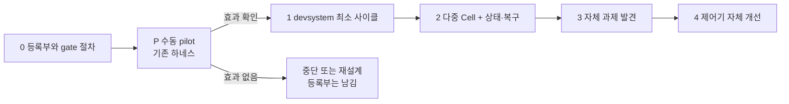

# Ganglion v2 자율개발 시스템 제안 v2

상태: 설계 제안 보완안 · 2026-10-08 · 구현 전

[v1 설계](autonomous_development_design.md)의 뼈대(두 루프 분리, 결정적 집행, 독립 검증)는 그대로 둔다. 바꾸는 것은 **순서와 무게 배분**이다. 인프라보다 판정 기준과 예산 회계를 먼저 고정하고, 기존 하네스로 작은 pilot을 돌려 효과를 확인한 뒤에 `devsystem`을 짓는다. 첫 실전 시나리오는 Ganglion 고유의 연결인 "제품 실패 → 코드 과제"다.

v1의 [복합 작업 명세](tasks/autonomous_development.md)와 [예시 설정](autodev/experiment.example.yaml)은 단계 1 이후의 계약으로 유지한다. 이 문서는 그 앞에 오는 단계 0과 P를 추가하고, v1의 단계 번호를 다시 매긴다.

## 0 v1 → v2 변경 대조

| 항목 | v1 | v2 | 이유 |
|---|---|---|---|
| 판정 기준 | acceptance predicate 이름만 선언, 작성 주체 없음 | gate 작성을 별도 단계로. 에이전트 초안 → 사람 승인·동결. 승인 시간을 핵심 지표로 | 에이전트가 쓰면 독립성이 무너지고, 사람이 쓰면 그 시간이 실제 비용 |
| 예산 | episode 240k 토큰, 작업 40k | 4개 카운터로 분리 회계. 수치는 pilot 측정값으로 교체. 가정값 명시 | v1 설계안을 쓴 세션 하나가 입력 28만 토큰 소비 |
| 단계 순서 | 단계 1에서 DB·lease·outbox·CAS·재개까지 요구 | 단계 0 → 수동 pilot(P) → 효과 확인 후 devsystem | 연구 질문은 인프라 없이도 답할 수 있음 |
| 첫 시나리오 | 단계 4(제품 연결)가 마지막 | "적용 불가 패치 → 코드 과제"를 첫 실전 과제로 | Ganglion 고유 기여. 재료가 이미 있음 |
| 실험 재현성 | 과제 집합과 지표만 정의 | 과제별 고정 시작 커밋, 비교군 × 과제 × seed 비용 사전 계산 | 한 번 고친 결함은 재사용 불가 |
| 우선순위 식 | 7항 가중합, 계수 고정 | 의존성 순서 + FIFO + 탐색 비율. 식은 데이터 생긴 뒤 | 계수를 정할 데이터가 없음 |
| Cell 수 | 12개 모듈 + 서브모듈 | pilot은 Cell 3개. 등록부는 전체, 활성화는 일부 | cross-cutting 변경이 잦아 조정 비용 큼 |
| 상태·복구 | SQLite WAL, lease, fencing, outbox, CAS | 그대로 유지. 단계 2부터 구현 | 설계는 타당하나 pilot엔 과함 |

## 1 연구 질문과 성공 기준

**같은 목표·같은 총자원·같은 판정 규칙에서, 동적으로 구성한 에이전트 팀이 단일 에이전트나 고정 팀보다 검증된 진척을 더 싸고 빠르게 만드는가?**

- **검증된 진척** = 동결된 gate를 독립 verifier가 통과시킨 통합 커밋. 코드 줄 수·테스트 개수·자체 평가는 제외 (v1 유지).
- **비용** = 모델 토큰(4개 카운터) + wall time + GPU/CPU + **사람 시간**(gate 작성·승인, 의미 질의 응답, 복구 개입).
- **부차 질문**: 제품 Analyzer의 실패가 사람 없이 코드 과제로 변환되어 통합까지 가는가 (§5).
- **이 제안이 답하지 않는 것**: 에이전트의 과제 발견 능력(별도 실험), 분산 호스트, main 자동 반영, 제품 배포.

## 2 판정 기준 작성 절차 (신규)

v1은 "admission 시점에 predicate가 동결 gate profile이 된다"고만 했다. v2는 누가, 언제, 무엇을 근거로 쓰는지를 정한다.

| gate 층 | 내용 | 작성자 | 구현자 공개 |
|---|---|---|---|
| L0 회귀 | 기존 `pytest`, import 호환, CLI smoke | 이미 존재 | 공개 |
| L1 과제 acceptance | 과제별 테스트·반례·metric predicate | spec-author 에이전트 초안 → 사람 승인·동결 | 비공개 (verifier 전용) |
| L2 소비자 계약 | 영향 그래프에서 고른 소비자 테스트 | ModuleSpec의 consumes/provides로 자동 선택 | 공개 |
| L3 제품 평가 | `compare_runs` 등 기존 primitive의 metric | 기존 코드 | 결과만 |

### 2.1 L1 작성 절차

1. steward 또는 사람이 Proposal을 낸다. Proposal에는 자연어 acceptance가 들어 있다.
2. **spec-author 세션**이 Proposal과 ModuleSpec만 보고 L1 gate 초안을 쓴다. 구현 코드를 쓰지 않으며 이후 같은 과제의 implementer가 될 수 없다.
3. **사람이 승인**한다. 수정하면 그 diff를 기록한다. 승인 시각에 gate hash를 동결한다.
4. 동결된 L1은 verifier 전용 저장소(`.autodev/gates/<task>/`)에 두고, 구현 워크트리에 mount하지 않는다.
5. 구현자가 실패 상세를 요구해 공개된 사례는 개발 자산으로 전환하고 L1에서 교체한다 (v1 유지).

### 2.2 측정

- `gate_authoring_minutes` = 사람이 L1을 읽고 승인하기까지의 시간. **과제당 1회이며 모든 비교군이 공유**한다.
- `gate_revision_count` = 승인 후 L1을 고친 횟수. 0이 아니면 그 과제의 결과는 "gate 불안정"으로 표시.
- `gate_draft_rejection_rate` = 사람이 초안을 폐기하고 직접 쓴 비율. 높으면 spec-author 단계 자체가 비용.

**왜 사람 승인을 빼지 않는가.** pilot 규모(과제 4~6개)에서 사람 승인은 과제당 수십 분이다. 이를 빼고 에이전트에게 맡기면 "에이전트가 자기 시험지를 쓴다"가 되어 실험의 핵심 변수가 오염된다. 승인을 자동화하는 것은 pilot 결과를 본 뒤의 별도 과제다.

## 3 예산 회계 (변경)

### 3.1 카운터 4개

| 카운터 | 의미 | 비고 |
|---|---|---|
| `in_uncached` | 캐시에 없던 입력 토큰 | 가장 비쌈 |
| `in_cached` | 캐시에서 읽은 입력 토큰 | 긴 세션에서 대부분을 차지 |
| `cache_write` | 캐시 기록 토큰 | 공급자별 과금 다름 |
| `out` | 출력 토큰 (추론 토큰 포함) | 단가 최고 |

- 예산 상한은 **cost unit** 하나로 둔다: `cost = Σ counter × weight`. weight는 공급자 단가 비율이며 정책 revision에 고정.
- 보고는 4개 카운터를 모두 남긴다. "토큰 N개"라는 단일 숫자는 쓰지 않는다.
- 계획·spec-author·steward·verifier·실패 attempt의 비용도 과제와 episode에 합산 (v1 유지).

### 3.2 가정값 (pilot 측정 전)

근거가 하나뿐이다: v1 설계안을 쓴 Codex 세션은 문서·코드를 읽는 약 5분 동안 입력 283k(캐시 225k 포함)를 썼다. 구현 과제는 이보다 길다. 아래 값은 pilot 첫 과제의 실측으로 교체한다.

| 단위 | v1 | v2 가정값 |
|---|---:|---:|
| 과제 1건 (팀 전체) | 40k | in 3–6M (캐시 80% 이상) · out 60–150k |
| wall time / 과제 | 30분 | 60–120분 |
| episode (과제 6개) | 240k · 2h | in 20–40M · out 0.5–1M · 8h |

- 첫 pilot 과제에서 **예산을 걸지 않고** 측정한다. 두 번째 과제부터 측정값의 2배를 상한으로 건다.
- 예산 소진은 실패가 아니라 `exhausted`로 기록하고 부분 진척을 보고 (v1 유지).

## 4 단계 재배열 (변경)

| 단계 | 범위 | 완료 조건 | v1 대비 |
|---|---|---|---|
| 0 등록부 | ModuleSpec 등록부(12 모듈), 경로 소유권 검사, consumes/provides, L1 gate 절차(§2), 과제별 고정 시작 커밋 | 소유권 충돌 0, dry-run으로 과제 4~6개의 TaskSpec·gate·시작 커밋 산출 | gate 절차 추가. 사람 개발자에게도 바로 쓸모 |
| **P pilot** | Claude Code / Codex의 워크트리 격리 서브에이전트. 제어기 없음. 사람이 스케줄러 역할. 검증은 별도 세션 | §6의 비교 실험 완료, 비용·사람 시간 실측, 예산 가정값 교체 | **신규.** devsystem 없이 연구 질문에 답함 |
| 1 최소 사이클 | DB(SQLite), attempt·lease, 워크트리 서비스, verifier job, 연구 브랜치 CAS 통합. outbox·reconciler는 아직 | 과제 1건이 제안→통합 자동 완료. 제어기 강제 종료 후 artifact에서 재개 | v1 단계 1에서 outbox·fencing 제외 |
| 2 다중 Cell | 전역 자원 배분, ChangeGroup, outbox, fencing token, intent reconciliation, 장애 주입 | v1 단계 2 + 장애 주입 불변식 통과 | v1의 복구 설계가 여기로 |
| 3 과제 발견 | steward trigger, 탐색 예산, cooldown, 중복 제거 | v1 단계 3 | 동일 |
| 4 자체 개선 | devsystem 후보, 기록 재생, shadow | v1 단계 5 | 동일. 제품 연결(v1 단계 4)은 §5로 이동 |

**P의 중단 기준.** 동적 팀이 고정 팀·단일 에이전트 대비 완료율이나 비용에서 과제 다수에서 열세이면 단계 1로 가지 않는다. 그 경우에도 단계 0의 등록부·gate 절차와 §5의 제품→개발 연결은 사람이 쓰는 도구로 남긴다.

## 5 첫 실전 시나리오: 제품 실패 → 코드 과제 (앞당김)

Ganglion이 범용 멀티에이전트 프레임워크와 다른 지점은 이것 하나다. 제품 루프가 스스로 못 고치는 실패를 개발 루프의 입력으로 넘기는 연결.

### 5.1 이미 있는 재료

- `analyzer/rules.py`가 실패 히스토그램에서 `RulePatch`를 제안한다.
- `contract/patch.py:apply_patch`는 기계적으로 적용할 수 없는 패치(새 arg, RawArg 교체, prompt nudge, `ESCALATE`)에 `PatchNotApplicableError`를 던진다.
- `analyzer/decisions.py`는 패치 결정을 ledger에 남기고, "porting은 commit_sha를 가진 코드 수정"이라고 이미 정의한다.
- PII 쪽은 `domains/pii/analysis.py`가 오류를 분류하지만 규칙 제안·채택이 없다 ([가명화 설계 §12.1](pseudonymization_pipeline_design.md)이 "후속 구현"으로 명시).

### 5.2 연결 규칙

1. `PatchNotApplicableError` 또는 `ESCALATE`가 난 패치 → `dev.proposal.created`. 근거 artifact = 해당 run의 `proposed_patches.jsonl` 행과 실패 trace id.
2. Proposal의 acceptance 초안 = "같은 run을 재실행했을 때 해당 failure_type의 건수가 X→Y로 감소, 다른 slice 회귀 없음". L1 gate는 `compare_runs`의 transition matrix로 기계 검사.
3. 통합된 코드로 만든 번들은 v2 제품 평가를 다시 거친다. 코드 gate 통과 ≠ 번들 승격 (v1 유지).
4. `patch_decisions.jsonl`의 `ported` 상태에 dev task id와 통합 commit_sha를 기록해 lineage를 닫는다.

### 5.3 pilot 과제 후보

- **tool-calling:** 기존 BFCL run에서 `PatchNotApplicableError`가 난 패치 1건을 골라 코드 과제로. 시작 커밋 고정.
- **PII:** "PII 규칙 제안 → 검증 → 채택" 경로 신설. 범위가 크므로 ChangeGroup 과제(domains.pii + analyzer.proposals)로.

## 6 pilot 실험 설계 (보완)

### 6.1 비교군

| 비교군 | 구성 | 검증 |
|---|---|---|
| A 단일 | 에이전트 1개가 순차 수행 | 별도 verifier 세션 (공통) |
| B 고정 팀 | implementer 1 + explorer 1, 과제 시작 시 고정 | 공통 |
| C 동적 팀 | 사람이 §4 P의 규칙대로 중간에 역할 추가·제거. 결정 시각과 근거 기록 | 공통 |

- P 단계에서는 C의 "동적"을 사람이 집행한다. 규칙은 미리 적어 두고(검증 backlog면 구현자 추가 금지, 원인 불명이면 explorer 추가 등) 그대로 따른다. 규칙 밖 개입은 `human_intervention`으로 센다.
- verifier는 작성 세션과 다른 세션, L1 gate만 보고 판정 (v1 유지).

### 6.2 과제 집합 (4~6개, 모두 고정 시작 커밋)

| 과제 | Cell | 성격 |
|---|---|---|
| T1 주입 결함 | contract.compiler | schema_compiler에 결함을 심고 숨긴 테스트로 판정. 독립·명확 |
| T2 trace·label 경계 | analyzer.traces + labels | v1 예시 과제. 경계 이관 |
| T3 적용 불가 패치 | contract + analyzer | §5 시나리오. 제품 실패에서 출발 |
| T4 TextEditPlan 변경 | domains.pii + runtime + adapters | ChangeGroup. 조정 비용이 큰 과제 |
| T5 새 spec 도착 | contract + benchmarks | 새 tier 추가. 소비자 영향 넓음 |

### 6.3 재현성

- 과제마다 `start_sha`를 고정하고 비교군·seed마다 그 커밋에서 새 워크트리로 시작.
- T1의 결함과 숨긴 테스트는 과제 생성 시 한 번만 만들고 모든 run이 공유.
- L1 gate hash, 모델 id, 하네스 버전을 run manifest에 기록. v1의 identity triple 관행과 같은 방식.

### 6.4 규모와 비용 계산

| 항목 | 값 |
|---|---|
| run 수 | 3 비교군 × 5 과제 × 3 seed = 45 |
| 모델 비용 (가정값) | 45 × (in 4M · out 100k) ≈ in 180M · out 4.5M |
| 사람 시간 | gate 승인 5 × 30분 + C 비교군 감독 15 run × 60분 ≈ 17.5h |
| wall time | 직렬 45 × 90분 ≈ 68h → 병렬 3이면 약 3일 |

- 이 비용이 과하면 seed를 2로 줄이고 과제를 4개로. 그 아래로는 통계적 주장을 하지 않고 사례 보고로 한다.
- 통계: 과제 단위 paired 비교, 완료율과 cost의 CI. n이 작으므로 "방향"만 보고하고 효과 크기 주장은 단계 1 이후로.

### 6.5 지표

- v1 유지: 검증된 완료율, 완료까지 cost unit·wall time, 통합 후 회귀, 할당 효율(유휴·backlog).
- 추가: `gate_authoring_minutes`, `gate_revision_count`, `human_intervention` 횟수·분, `verifier_disagreement`(같은 후보를 verifier 2개가 다르게 판정한 비율).

## 7 단순화 (변경)

- **우선순위:** 의존성 위상 순서 → 같은 층에서는 FIFO. 탐색 과제는 전체 슬롯의 15% 한도. v1의 7항 가중합은 pilot 데이터로 계수를 추정할 수 있을 때 도입.
- **Cell:** 등록부에는 12 모듈을 모두 넣되, 활성 Cell은 pilot 과제가 닿는 `contract`, `analyzer`, `domains.pii`(+adapters) 3개. 나머지는 소유권·소비자 검사에만 쓴다.
- **모델 선택:** capability 등급 2개(코딩용·검증용)로만 배정 (v1 유지).
- **상태 저장소:** P 단계는 git 브랜치 + 디렉터리 하나(`.autodev/pilot/<task>/<arm>/<seed>/`)에 manifest·gate 결과·비용 JSON. SQLite는 단계 1부터.

## 8 v1에서 그대로 유지하는 것

- 두 루프 분리: 번들 승격(Registry)과 코드 승격(연구 브랜치)의 대상·권한·증거 분리.
- 승인·배정·예산·승격은 결정적 코드가 집행. 에이전트는 `subtask.proposed`만 제출.
- ModuleCell = 레코드, 평소 활성 세션 0, ContextPacket으로 세션 교체.
- 역할 5종(steward, implementer, explorer, verifier, integrator) + **spec-author 추가**.
- ContractChangeProposal, ChangeGroup, 인터페이스 동결 후 구현 배분.
- 워크트리는 보안 격리가 아님. 자유 shell 단계에서는 container 경계.
- 판정 입력 격리: oracle은 별도 프로세스, 후보 환경에 정답 mount 금지.
- SQLite WAL, lease + fencing token, outbox, integration intent + CAS + reconciler, 장애 복구 표 — 단계 2에서 구현.
- 승격 권한 분리: 연구 브랜치 자동, main·push·배포는 별도.
- 자체 개선은 기록 재생 → shadow, 실행 중 제어기 직접 교체 금지.

## 9 결정이 필요한 항목

1. **트랙 분리:** MLSys(10/30)·PII 실증과 별도 트랙으로 두고, P 단계를 11월 이후로 잡을지.
2. **pilot 규모:** 5과제 × 3seed(약 3일, 사람 17h)로 갈지, 4과제 × 2seed로 줄일지.
3. **하네스:** P 단계에서 Claude Code 서브에이전트, Codex, 또는 둘 다 쓸지. 둘 다면 하네스를 변수로 추가해야 함.
4. **첫 과제:** T1(주입 결함, 가장 싸고 명확) 먼저인지, T3(§5 시나리오, Ganglion다움) 먼저인지.
5. **문서 반영:** 결정 전까지 v1과 이 v2를 나란히 둔다. v2가 채택되면 v1의 단계 표와 예시 설정의 예산 값을 이 문서 기준으로 고친다.
