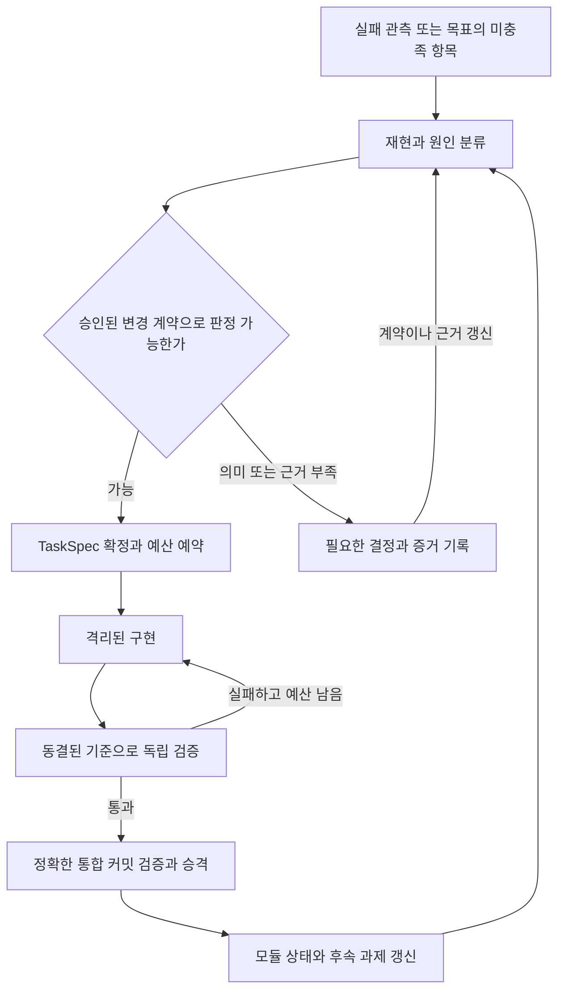

# Ganglion 자율개발 시스템 제안 v3

상태: 설계 제안 · 2026-10-08 · 개발 제어기와 변경 계약 실행기는 구현 전

**검증할 수 있는 변경부터 스스로 완료하고, 그 범위를 점차 넓히는 자율개발 시스템을 만든다.** 첫 버전부터 실패 관측·과제 확정·구현·검증·연구 브랜치 통합을 자동으로 연결한다. 사람은 목표와 변경 종류별 판정 계약을 정하고, 시스템은 합의된 범위의 반복 작업을 끝까지 수행한다. 동적 팀 구성은 이 루프에서 교체하고 비교할 수 있는 실행 정책으로 둔다.

[v1 설계](autonomous_development_design.md)의 책임 경계·독립 검증·통합 보장을 유지하고, [v2 제안](autonomous_development_design_v2.md)의 비용 회계와 비교 실험을 발전시킨다. v3는 자율개발 제안의 버전이며, 제품의 기준은 계속 [Ganglion 아키텍처 v2](architecture_v2.md)다. 성능 우위는 아래 실험으로 검증할 가설이다.

## 1 설계 선택과 성공 기준

| 항목 | v1 | v2 | v3 |
|---|---|---|---|
| 출발점 | 모듈별 동적 팀과 개발 제어기 | 사람이 배정하는 pilot | 한 종류의 변경을 완료하는 자동 루프 |
| 초기 사람 역할 | 목표·정책·미정 의미 결정 | 과제별 gate 승인과 팀 배정 | 변경 종류별 계약 승인과 예외 해결 |
| 확장 단위 | Cell과 구현 단계 | pilot 이후 인프라 단계 | 판정 가능한 변경 종류와 적용 범위 |
| 동적 팀 | 핵심 연구 대상 | 핵심 비교 대상 | 공통 실행기의 배정 정책 |
| 초기 복구 | lease·fencing·통합 reconciliation | 일부 보장을 단계 2로 연기 | 첫 자동 통합부터 최소 보장 유지 |
| 초기 산출물 | 제어기와 검증된 변경 | 실험 결과와 등록부 | 재사용할 계약·자동 루프·검증된 변경 |

첫 질문은 **승인된 범위에서 중간 지시 없이 유용한 변경을 반복해서 완료할 수 있는가**다. 두 번째 질문은 같은 실행기에서 추가 에이전트가 완료율·시간·비용을 개선하는가다. 단일 구현자가 더 유리하면 그 정책을 유지하며, 개발 루프의 유용성을 별도로 평가한다.

진척은 동결된 기준을 통과한 정확한 통합 커밋과 목표 달성으로 측정한다. 테스트 수, patch 수, 등록한 계약 수는 진척의 대체 지표가 아니다. 자동으로 처리할 수 있는 변경 종류가 늘었다는 주장은 새 종류의 별도 과제를 실제로 완료한 근거를 요구한다.

자율 완료는 과제 접수 이후 사람이 판정 의미·구현 방향·팀 배정을 바꾸지 않고 통합까지 끝난 실행이다. 사전 계약 작성 시간은 준비 비용으로, 실행 중 도움은 사람 개입으로 각각 기록한다. 도움을 받아 완료한 과제도 진척에는 포함하되 자율 완료와 구분한다.

## 2 변경 종류별 계약

`ChangeContract`는 반복해서 맡길 수 있는 변경 종류의 범위와 판정 방법이다. v1의 `TaskSpec`은 개별 과제를 표현하고, ChangeContract는 그 TaskSpec을 자동으로 확정해도 되는 조건을 표현한다. `ModuleSpec`은 코드 소유권과 의존 관계를 계속 담당한다.

| 필드 | 의미 |
|---|---|
| `id`, `revision`, `approval_ref` | 계약의 식별자, 버전, 목표 소유자의 승인 근거 |
| `objective_ref`, `semantic_refs` | 상위 목표와 요구 동작을 정의한 명세의 hash |
| `applicability` | 지원 입력·변경 종류와 자동 접수에 필요한 기계적 조건 |
| `scope` | 읽기·쓰기 경로와 symbol, 소유 Cell, 보호할 코드·설정 |
| `instance_builder_ref` | 관측 근거에서 TaskSpec과 판정 입력을 구성하는 고정 구현 |
| `oracle_profile_ref` | 기대 결과의 출처, 판정 프로그램과 실행 환경의 hash |
| `required_gates` | 과제 성공 조건, 소비자 호환성, 회귀와 증거 충족 조건 |
| `budget_profile_ref` | 비용·시간·재시도·판정 조회·동시 실행 상한 |
| `escalation_rules` | 의미 불명확, 범위 초과, 증거 부족과 계약 변경 시 처리 |
| `promotion_policy_ref` | 승격할 연구 브랜치, 권한, 재검증과 복구 정책 |

모든 참조는 실행 시점에 불변 버전으로 해석한다. 상한이나 oracle 근거가 빠진 계약은 초안으로 보관하며 실행 가능한 상태로 등록하지 않는다. 에이전트가 applicability를 만족한다고 서술한 것만으로 자동 접수하지 않는다. 결정적 검사로 확인하지 못한 조건은 `needs_decision`으로 남긴다.

계약의 첫 범위는 **이미 지원한다고 명시된 compiler 동작의 결함 수정**이다. 지원하지 않는 스키마 기능 추가나 도메인 의미 변경은 별도 종류다. 예를 들어 기존 문자열 enum의 허용 집합을 보존하는 수정과, enum 밖 값을 근사 보정하도록 의미를 바꾸는 수정은 같은 계약으로 승인할 수 없다.

### 계약 승인과 개별 과제 확정

1. 사람 또는 spec-author 세션이 명세·기존 검증 자산을 근거로 ChangeContract를 작성한다. spec-author의 자연어 판단이 기대 정답의 유일한 출처가 되지 않게 한다.
2. 계약이 정의하는 동작을 만족하는 기준 사례와 대표적인 오답 후보로 판정기를 점검한다. 후보 코드가 제공하는 구현·테스트와 분리된 기준을 사용한다.
3. 목표 소유자가 의미·범위·판정 방법·예산 정책을 승인한다. 계약과 그 작성·승인 비용을 저장한다.
4. 관측 근거가 들어오면 고정된 instance builder가 적용 조건과 재현을 검사하고 TaskSpec을 만든다. 공개 요구사항, 성공 predicate, 검증 입력과 시작 커밋을 이 시점에 동결한다.
5. 승인된 의미와 범위를 벗어난 사례는 필요한 결정을 기록한다. 새 의미를 사람이 확정하면 계약의 새 revision 또는 별도 계약을 만든다.

개별 과제에 새 테스트 사례가 생겨도 승인된 규칙으로 입력과 정답을 도출할 수 있으면 다시 승인받지 않는다. 새로운 예시의 정답을 LLM이 추측해야 한다면 자동 확정 대상이 아니다. 검증 가능한 성질이 일부뿐이면 그 성질만 확인했다고 기록하며 전체 의미가 맞다고 확대 해석하지 않는다.

계약은 `draft → approved → suspended | retired`로 관리한다. 판정 오류나 허용 범위의 결함이 확인되면 해당 revision의 신규 접수·미완료 승격을 멈추고 이미 통합된 변경의 영향도 조사한다. 변경된 기준으로 실행한 결과는 새 revision에 귀속한다.

## 3 과제 발견과 자동 실행 루프

입력은 제품 실패, CI 회귀, 명세와 구현의 차이, 승인된 목표의 미구현 항목이다. 명확한 목표가 있는 기능 추가도 받을 수 있다. 이미 재현 가능한 결함만 계속 고치는 것으로 장기 범위를 제한하지 않는다.



제안은 상위 목표 또는 정책으로 정한 탐색 예산에 연결한다. 같은 원인·목표·입력 버전의 제안은 중복 제거한다. 이미 실패한 접근을 재시도하려면 새로운 근거·입력·가설 중 무엇이 달라졌는지 남긴다. 준비된 과제가 없고 탐색 trigger도 없으면 모델을 호출하지 않는다.

접수 결과는 `admitted`, `needs_decision`, `insufficient_evidence`, `rejected`로 나눈다. 입력 오류를 바로 개발 과제로 승격하지 않으며, 보류된 과제 때문에 독립적인 준비 작업을 막지 않는다. 의존 관계가 있는 작업만 해당 조건이 해소될 때까지 대기한다.

실행 과제의 기본 상태는 다음과 같다.

```text
ready → active → submitted → verifying → integrating → completed
검증 실패 + 남은 예산 → 새 attempt를 만들어 active
의미·범위 결정 필요 → blocked
판정에 필요한 증거 부족 → blocked 또는 bounded evidence job
예산·deadline·재시도 한도 도달 → exhausted
입력·계약·정책 변경으로 유효성 상실 → superseded
정책에 따른 취소 → cancelled
```

TaskSpec은 하나의 원하는 결과를 표현하며 attempt는 그 결과를 위한 시도다. 실패한 attempt의 기록을 덮어쓰지 않는다. 예산 소진 시 patch와 증거를 보존하지만 completed로 집계하지 않는다. 각 episode는 완료·미완료 목표와 미정 비용을 포함한 한 개의 terminal report를 남긴다.

통합 후에는 실제 코드와 증거 hash로 Cell 기억을 갱신하고, 영향받는 후속 과제의 입력을 다시 확정한다. 에이전트 요약은 검색 자료이며 최신 계약·코드·검증 결과를 대신하지 않는다.

## 4 첫 버전의 실행기와 복구 보장

초기 구성은 단일 호스트, 단일 제어기, SQLite WAL, 파일 artifact 저장소, 격리된 worker adapter다. 한 번에 하나의 구현 후보를 활성화하고 검증과 통합을 순차 수행한다. 기존 하네스는 worker 실행에 이용하되 배정·재시도·승격은 고정 코드가 결정한다.

논리 책임은 계약 등록·과제 접수, 상태·예산 관리, 작업 공간·worker 실행, 검증, 통합으로 나눈다. 처음부터 각각 별도 서비스로 만들지 않는다. [v1의 devsystem 구성](autonomous_development_design.md)의 코드 위치와 책임을 따르되 필요한 부분부터 구현한다.

### 처음부터 유지할 불변식

| 영역 | 최소 보장 |
|---|---|
| 입력 | 코드·목표·계약·gate·실행 환경의 버전을 고정한다. 변경 시 기존 증거 재사용 여부를 다시 판정한다. |
| 단일 제어기 | 호스트의 배타 잠금으로 두 제어기가 동시에 실행되지 않게 한다. 재시작은 기존 실행 상태를 먼저 대조한다. |
| 시도 소유권 | 역할 slot의 현재 attempt와 fencing token, 만료 여부가 일치할 때만 heartbeat·결과·artifact를 채택한다. |
| 실제 자원 | worker와 자식 프로세스의 종료 또는 격리를 확인한 뒤 자원을 다시 배정한다. 불명확하면 해당 자원을 보류한다. |
| 예산 | 호출 전 예약하고 정산한다. 결과를 잃은 호출의 비용은 미정 예약액으로 유지한다. |
| 검증 | worker는 필수 gate·정답·판정 프로그램·제어기 DB를 변경할 수 없다. |
| 통합 | 검증한 정확한 통합 SHA만 승격하며, Git ref와 DB 상태를 대조할 기록을 먼저 저장한다. |
| artifact | 임시 파일 작성과 hash 확인을 마친 뒤 원자적으로 publish한다. 누락된 artifact를 성공 증거로 취급하지 않는다. |

Git worktree는 작업 파일을 나누는 수단이다. 자유 shell을 제공하는 worker는 container 또는 동등한 실행 경계 안에서 실행하며 공통 Git 관리 경로와 제어기 저장소의 쓰기를 허용하지 않는다. WorkspaceService가 patch 수집과 커밋을 담당하고, 생성·삭제·rename·symlink·설정 변경까지 실제 scope를 확인한다. 검증 프로그램도 후보 코드를 격리해서 실행한다.

하네스가 필수 사용량 기록·실행 취소·파일 접근 경계를 제공하지 못하면 adapter에서 보완하거나 실행 가능한 범위를 줄인다. 부족한 보장을 worker의 지시 준수에 맡긴 채 자동 통합하지 않는다.

### 영속 단계와 통합 절차

제어기는 `tasks`, `attempts`, `steps`, `reservations`, `verification_reports`, `integration_intents`와 감사 이벤트를 저장한다. 외부 작업 전에 step intent를 기록하고 완료 시 결과 artifact를 연결한다. 상태 변경과 감사 이벤트는 같은 DB 트랜잭션에 기록한다. 초기에는 제어기가 미완료 step을 직접 처리하므로 별도 broker와 fan-out consumer가 필요하지 않다.

프로세스 실행은 supervisor가 영속 `step_id`로 추적해야 한다. 재시작 시 실행 중인지 알 수 없는 작업을 무조건 다시 호출하지 않는다. 실행 상태와 비용을 대조할 수 없으면 해당 step을 보류하고 프로세스를 정리한다. 외부 API의 exactly-once 실행은 가정하지 않는다.

통합은 다음 순서로 수행한다.

1. 현재 연구 브랜치의 `expected_sha`와 patch로 통합 후보를 만든다.
2. 그 정확한 SHA에서 필수 gate와 소비자·시스템 회귀 검사를 완료한다.
3. expected SHA, 후보 SHA, 정책과 검증 참조를 가진 integration intent를 저장한다.
4. 입력·계약·정책의 유효성을 다시 확인하고 Git 참조를 compare-and-swap으로 갱신한다.
5. 실제 참조를 대조해 committed로 기록하고 후속 상태를 갱신한다.

CAS 직후 종료되면 재시작 시 실제 ref가 후보를 가리키는지 확인해 완료 기록을 복구한다. expected를 가리키면 검증 유효성을 확인한 뒤 재시도하고, 다른 SHA를 가리키면 stale로 처리해 통합 후보를 다시 만든다. rebase나 충돌 해결로 코드가 달라졌을 때 이전 SHA의 보고서를 사용하지 않는다.

멀티 worker나 독립 서비스가 필요해지면 transactional outbox와 멱등 consumer를 추가한다. 추가 시점이 늦어지는 것은 이벤트 배달 구조이며, 현재 attempt 확인·예산 예약·통합 reconciliation은 첫 자동 실행부터 유지한다.

## 5 판정 기준과 증거의 독립성

gate는 통합 전 반드시 만족해야 하는 실행 가능한 검사다. 구현자에게 요구 동작·허용 범위·성공 predicate와 공개 개발 테스트를 제공한다. 독립 판정용 사례·정답·조회 정책은 verifier가 관리한다. 공개해야 할 요구사항까지 숨겨 구현자가 의미를 추측하도록 만들지 않는다.

판정 실행은 고정된 프로그램을 우선한다. 별도 LLM 검토가 필요한 계약은 그 역할과 실패 분기를 명시하지만, 검토 의견만으로 빠진 실행 증거를 대체하지 않는다. 같은 모델의 세션을 분리했다는 사실만으로 판정 독립성을 주장하지 않는다.

| 검사 | 확인할 내용 |
|---|---|
| 계약 적합성 | 입력 종류, 실제 변경 scope, 보호 자산, 명세·정책 revision |
| 과제 acceptance | 재현 사례의 해결, 동결한 의미 predicate, 승인된 반례·경계값 |
| 소비자와 회귀 | 고정된 필수 검사와 신뢰할 수 있는 영향 선택기가 고른 소비자 검사 |
| 증거 완전성 | 예정 사례 수와 실제 실행 수, skip·누락·미채점, 정답·환경 버전 |
| 통합 검증 | 최신 대상 위에 구성한 정확한 커밋의 필수 gate |

후보가 수정한 테스트는 추가 개발 증거로 쓸 수 있다. 필수 판정기는 별도 고정 artifact에서 실행하며 후보의 테스트 설정이나 shell 문자열을 신뢰해 검사 범위를 정하지 않는다. 영향 정보가 불완전하면 회귀 범위를 넓히고, 판정 자체가 불가능하면 `insufficient_evidence`로 처리한다.

기대 정답은 승인된 명세의 직접 predicate, 사람이 검증한 fixture, 의미 범위가 확인된 독립 reference 구현 등에서 얻는다. reference가 후보의 같은 결함 있는 함수를 호출해 정답을 만드는 구조는 피한다. metamorphic property는 해당 성질의 증거이며 모든 동작의 정답을 대신하지 않는다. 대표 오답 후보를 걸러내는 점검도 gate의 완전성을 증명하지는 않는다.

후보 프로세스에는 요청 입력만 전달한다. 정답 파일·oracle credential을 mount하지 않고 별도 oracle 프로세스가 출력을 비교한다. 개발 검증과 최종 독립 판정을 구분하고, 계약에 정한 조회 한도 안에서만 독립 판정을 실행한다. 상세 실패를 공개한 사례는 개발 자산으로 전환하며 대체 사례와 gate revision을 기록한다. 공정한 비교에 필요한 판정 기준이 바뀌면 해당 실험을 분리하거나 같은 새 기준으로 다시 수행한다.

## 6 첫 변경 계약과 실행 예시

첫 계약은 `compiler-preserve-supported-semantics`로 제안한다. 근거는 [compiler 작업 명세](tasks/contract_schema_compiler.md)와 [현재 지원 범위](tool_schema_compiler.md)다. 아래는 계약을 구체화하기 위한 예시이며 현재 코드에 해당 결함이 있다는 주장은 아니다.

**예시 문제:** 지원하는 문자열 enum 스키마를 컴파일한 결과가 허용 값 하나를 누락한다. 승인된 기대 동작은 명시된 허용 값을 보존하고 기존 명세에서 거부하도록 정한 값을 거부하는 것이다. 새 값의 추론이나 별칭 발명은 범위에 넣지 않는다.

| 항목 | 첫 계약에 포함할 내용 |
|---|---|
| 관측 | 입력 스키마 hash, 재현 입력, 기대 동작의 명세 참조, 실제 출력, 시작 SHA |
| 쓰기 범위 | `ganglion/contract/schema_compiler.py`와 지정한 개발 테스트 |
| 소비자 | 영향을 받는 Catalog·mapper API와 지정된 benchmark 검사 |
| 과제 확정 | 지원 subset 여부와 기준 코드의 실제 위반을 고정 검사로 확인 |
| 정답 근거 | 스키마에 명시된 집합과 승인된 정규화 규칙으로 기대 계획을 계산 |
| 필수 판정 | 재현 해결, 허용·거부 사례, 정규화·round-trip, 소비자·시스템 회귀 |
| 보류 조건 | 명세 간 의미 충돌, 미지원 스키마 기능, 계약 밖의 코드 수정 필요 |

첫 실행은 공개 재현 사례와 별도의 판정 사례를 동결하고 구현자 한 명에게 맡긴다. 구현자는 patch와 자체 검사 결과를 제출한다. 제어기는 실제 scope를 확인한 뒤 독립 검증·통합 검증을 수행한다. 통합된 코드에서 완료 근거를 Cell에 연결한다.

gate 보정에는 지원 동작을 의도적으로 깨뜨린 주입 결함을 사용할 수 있다. 주입 위치와 정답은 구현자에게 제공하지 않고 생성 근거와 시작 SHA를 보관한다. 실제 결함을 확보하지 못한 동안의 결과는 주입 과제에 대한 실행 검증으로 보고하며 실제 제품 개선으로 집계하지 않는다.

## 7 제품 실패에서 코드 과제로 연결

제품 루프와 개발 루프는 서로의 입력과 결과를 연결하되 승격 권한을 나눈다. 제품 Analyzer가 제안한 패치의 적용 실패는 분류할 신호다. [현재 PatchNotApplicableError](../ganglion/contract/patch.py)에는 지원하지 않는 코드 변경뿐 아니라 잘못된 catalog·tool·payload도 포함된다.

| 분류 | 처리 |
|---|---|
| 입력·대상 오류 | 입력 수정이나 올바른 run·catalog 선택으로 반환. 코드 결함 근거가 추가되면 재분류 |
| 제품 recipe로 해결 가능 | 규칙·데이터·모델 후보 제작으로 반환 |
| 의미·명세 결정 필요 | 목표 소유자에게 구체적인 미정 조건을 남김 |
| 구현 결함 또는 지원 기능 부족 | 승인된 ChangeContract와 일치하면 개발 과제로 확정 |
| 근거 불충분 | 제한된 재현·분석 작업 후 재분류하거나 보류 |

LLM은 원인 가설과 관련 계약을 제안할 수 있다. 코드 변경의 자동 접수는 재현 결과·명세 참조·적용 조건 검사로 확정한다. `ESCALATE`라는 이름만으로 승인된 의미나 코드 수정 권한이 생기지 않는다.

제품 과제의 판정은 해당 `failure_type`의 건수 감소만으로 정하지 않는다. 기준·후보 run의 사례 집합, 정답 snapshot, 평가 프로그램과 slice 정의를 고정하고 실제 성공 전환·회귀·누락·미채점을 함께 검사한다. 공개된 원인 분석 사례와 최종 독립 평가 사례를 구분한다. 허용 회귀·최소 개선·표본 조건은 과제 시작 전에 계약에서 확정한다.

[현재 compare_runs](../ganglion/analyzer/compare.py)는 두 run의 각 최신 라벨을 읽는다. 이를 재사용하려면 동일한 승인 정답을 연결한 불변 평가 snapshot과 버전 확인 adapter가 필요하다. 기존 trace·label 저장소를 단순히 다시 읽는 것만으로 동결된 평가가 되지는 않는다.

lineage는 `제품 run과 patch → 개발 TaskSpec → 통합 SHA → 제품 재생성 job → 독립 제품 평가`로 잇는다. [현재 PatchDecision](../ganglion/analyzer/decisions.py)의 `ported`와 `commit_sha`를 코드 이관 증거로 사용한다. dev task 참조는 별도 lineage 레코드로 연결하거나 명시적인 스키마 변경으로 추가한다. `ported`를 제품 번들 승격으로 해석하지 않는다.

## 8 모듈 지식과 팀 배정

ModuleCell은 소유권·의존성·검증된 지식·미해결 과제를 보관하며 평상시 활성 에이전트는 0명이다. 처음에는 첫 계약의 소유 경로와 소비자 관계만 등록한다. 12개 모듈과 모든 하위 Cell의 완전한 등록을 첫 실행의 선행 조건으로 삼지 않는다. 새 범위를 활성화하기 전에는 해당 범위의 소유권·계약·gate를 확정한다.

ContextPacket은 고정된 목표·코드·계약 revision, 공개 요구사항, 관련 API와 허용 증거를 담는다. 역할별 접근 경계를 적용하고, 전체 대화 대신 검증된 artifact 참조로 세션을 교체한다. 모듈을 가로지르는 과제는 실제 영향 범위로 팀을 구성한다.

추가 에이전트 요청은 해결되지 않은 질문, 독립적인 범위, 기대 산출물과 비용 상한을 포함해야 한다. 초기 실행기는 단일 구현자 정책을 쓰며 아래 정책은 병렬 실행 보장을 갖춘 뒤 비교한다.

| 관측과 고정 정책의 조건 | 추가 역할 | 요구 산출물 |
|---|---|---|
| 원인 불명이고 제한된 진단이 남은 예산 안에 있음 | explorer | 재현 사례와 가설을 구분하는 실험 결과 |
| 의존성·쓰기 범위가 분리된 하위 작업 확인 | implementer | 각 범위의 patch와 검사 결과 |
| 소비자 계약의 불확실성이 남음 | 소비자 검토 역할 | 위반 반례 또는 고정 계약 검사 결과 |
| 검증 대기가 정책 임계값을 넘음 | 검증 자원 우선 배정 | 대기 중인 후보의 판정 결과 |

원인 분류를 위한 LLM 제안은 고정된 배정 조건을 통과해야 한다. 에이전트가 스스로 worker를 무제한 생성하지 않는다. 배정 시점·근거·정책 버전을 기록하고 구현·탐색·검증 비용 모두 같은 부모 예산에서 차감한다.

작업 공간마다 writer는 하나다. 같은 파일의 대안 구현은 별도 후보 공간에서 수행한다. 계약을 함께 바꿔야 하는 작업은 v1의 ContractChangeProposal과 ChangeGroup으로 묶고, 인터페이스를 확정한 뒤 조합을 검증한다. 준비 작업은 의존성 순서와 FIFO로 배정하며 가중 우선순위·자동 모델 선택은 관측 근거가 생긴 뒤 도입한다.

## 9 비용과 중단 정책

첫 보정 실행부터 비용·wall time·재시도·판정 조회 상한을 둔다. 한 문서 작성 세션의 사용량을 전체 구현 과제의 예산으로 외삽하지 않는다. 별도 보정 과제에서 실행 가능 범위를 측정한 뒤 본 실험의 공통 예산을 동결한다. 보정 비용도 총투자에 포함한다.

모델 원시 사용량과 과금 정규화 결과를 함께 저장한다. 입력 비캐시·캐시 읽기·캐시 쓰기·출력 카운터를 구분하되 공급자 필드의 포함 관계를 adapter에 명시한다. 추론 토큰이 이미 출력에 포함되거나 캐시 쓰기가 입력에 포함되는 경우 두 번 합산하지 않는다. 해당하지 않는 필드와 측정하지 못한 필드를 구분하고, 알 수 없는 사용량을 0으로 기록하지 않는다.

비용 상한은 고정된 단가표 또는 cost-unit 정책으로 집행한다. 예약에는 다음 호출의 최대 사용량과 필수 검증·통합에 필요한 여유를 포함한다. 계획·과제 접수·탐색·실패·수정·검증·통합과 자식 작업 비용을 빠짐없이 정산한다. task 상한과 episode 상한을 모두 확인한다.

사람의 계약 작성·승인 시간, 실행 중 개입 시간, 복구 시간을 각각 보고한다. 모델 비용·CPU/GPU 사용·wall time과 구분하며 합의된 환산 기준 없이 하나의 점수로 더하지 않는다. 제어기 구축 비용과 계약 준비 비용, 과제당 운영 비용을 따로 보여 재사용 횟수에 따른 비용도 계산할 수 있게 한다.

예산·deadline·시도 한도·새 근거 없는 반복의 한도에 도달하면 신규 호출을 중단하고 상태를 정산한다. 품질 기준을 낮춰 통과시키지 않는다. 결정이 필요한 과제는 원인과 필요한 입력을 남기고, 현재 정책에서 해결 가능한 다른 작업을 계속한다.

## 10 구현 단계와 완료 조건

| 단계 | 구현과 적용 범위 | 다음 단계의 조건 |
|---|---|---|
| 0 첫 계약 | compiler 변경 계약, 필요한 ModuleSpec, 독립 oracle·gate, 예산 profile | 지원 범위와 성공 기준 동결, 대표 정답·오답 후보 점검, TaskSpec 생성 가능 |
| 1 자동 전체 사이클 | 과제 접수, 단일 worker, 상태·예산, 격리 검증, 연구 브랜치 통합 | 한 과제를 중간 배정 없이 완료하고 아래 장애 불변식을 통과 |
| 2 같은 종류의 연속 과제 | 변경 trigger, 중복 제거, Cell 기억, 제한된 재현·분석 | 별도 평가 과제들에서 반복 승인 없이 실행하고 완료·보류·비용·개입을 모두 기록 |
| 3 제품 연결 | 적용 실패 분류, 개발 과제 확정, 코드와 제품 평가 lineage | 실제 제품 실패 하나를 수정한 코드로 재평가하고 번들 판정을 분리 |
| 4 변경 종류 확장 | 소비자 변경, 명확한 새 기능, ChangeGroup | 새 종류의 계약·호환성·gate 확보 후 독립 과제의 완료 증거 축적 |
| 5 배정 정책 확장 | 조건부 탐색·병렬 구현·검증 자원 배정 | 같은 실행기의 비교에서 사전 선택한 품질·비용·시간 기준 충족 |

첫 계약의 재현 근거를 제품 run에서 얻을 수 있으면 단계 1부터 이를 사용한다. 단계 3은 전체 제품 재생성과 독립 릴리스 판정까지 연결하는 완료 조건이다. 명세가 미정인 새 기능은 계약을 먼저 확정하며 단계 4라는 이유만으로 자동 승인하지 않는다.

단계 1에서 확인할 장애는 worker 강제 종료, 중복 관측, 만료 후 늦은 제출, 비용 예약 직후 종료, 프로세스 생성 직후 종료, CAS 직후 종료, 대상 브랜치 변경, artifact 누락이다. 판정은 다음 불변식으로 한다.

- 통합은 유효한 gate가 통과한 정확한 SHA만 참조한다.
- 과거 attempt 결과는 채택되지 않으며 중복 통합 효과가 없다.
- 실행 여부가 불명확한 작업을 무조건 재실행하지 않는다.
- 미정 비용과 미종료 프로세스의 자원을 임의로 해제하지 않는다.
- 실패·미완료 결과를 성공으로 바꾸지 않고 근거와 복구 상태를 보존한다.

여러 후보를 병렬화하기 전에는 후보별 fencing, 부모 예산 합산, 취소·자원 회수, 공유 계약 변경과 조합 검증을 추가로 확인한다. 제어기 자체 개선은 이 단계들과 별도로 후보 버전의 기록 재생·shadow 실행을 거쳐 다루며, 실행 중인 제어기·gateway·gate를 worker가 교체하지 못한다.

## 11 실험과 평가

### 자동 개발 루프의 유용성

평가 과제 집합은 목표에 관련된 실제 결함·미충족 항목과 지원 밖·근거 부족 사례를 함께 포함한다. 접수에서 제외한 과제를 숨기지 않는다. 원인별 중복 제거 규칙과 평가 대상 분모를 사전에 고정한다. 수정할 목표가 없는 잘못된 입력은 접수 정확성용 사례로 표시하고 목표 달성률의 분모와 구분한다. 유효한 목표지만 현재 계약으로 처리하지 못한 과제는 전체 목표의 분모에 남긴다.

| 지표 | 측정 방법 |
|---|---|
| 전체 목표 달성률 | 고정 평가 대상의 목표 중 독립 확인한 통합 완료 비율 |
| 적용 범위와 처리율 | 전체 대상 중 계약으로 admitted된 비율과 admitted 중 완료 비율을 함께 보고 |
| 자율 완료율 | admitted 중 실행 중 사람 개입 없이 통합한 비율. 도움받은 완료는 별도 표시 |
| 접수·보류의 정확성 | 독립 검토 기준으로 잘못 접수하거나 불필요하게 보류한 사례와 비용 |
| 전체 운영 비용 | 실패·소진·재검증을 포함한 비용, 사람 시간과 wall time |
| 통합 품질 | 고정 관측 기간의 회귀·revert·소비자 계약 위반과 재판정 결과 |
| 계약 재사용 효과 | 계약 준비 비용, 재사용 과제 수, 수정·중단 빈도, 종류별 실제 완료 결과 |

사람 운영 개발과의 시간 절감까지 주장하려면 같은 목표·판정 기준의 별도 기준선을 둔다. 자동 루프가 작동했다는 결과만으로 사람보다 싸거나 빠르다고 결론 내리지 않는다.

### 배정 정책의 효과

동일 실행기에서 A는 구현자 하나를 유지하고 B는 고정 조건에 따라 탐색·구현 역할을 추가한다. 고정 팀 C는 연구 질문에 필요할 때 추가한다. 모든 비교군은 같은 독립 검증 서비스와 통합 절차를 사용하며 그 비용을 포함한다. 사람이 B의 스케줄러 역할을 하지 않는다.

과제별 시작 SHA, 계약·gate·데이터·정답 snapshot, 모델 id와 접근 조건, 하네스·환경 버전, 비용·시간 상한을 고정한다. 정책 보정 과제와 최종 평가 과제를 분리하고 비교군의 실행 순서를 균형 있게 배치한다. 세션 기억·후보 patch·판정 피드백이 다른 비교군이나 반복 실행으로 넘어가지 않게 한다. 캐시 공유 조건도 동일하게 관리하거나 통제하지 못한 차이를 보고한다.

반복 실행의 seed와 실제 설정을 기록하되 외부 모델의 완전한 재현성을 가정하지 않는다. 과제 단위 paired 비교로 완료율과 비용·시간 분포 및 불확실성을 보고한다. 같은 결함의 반복 run만으로 서로 다른 과제에 대한 표본 수를 늘리지 않는다. 적은 과제의 결과는 사례 범위 안에서 해석한다.

주요 판정 기준과 허용 회귀 폭은 평가 전에 정한다. 예를 들어 동일 예산에서 완료율을 유지하면서 사람 개입을 줄이는지, 또는 품질 하한을 유지하면서 시간을 줄이는지를 선택한다. 완료한 run의 비용만 평균내지 않으며 소진·실패 비용과 시간 한도 내 미완료를 함께 반영한다.

작업 발견 비교에는 같은 시점의 목표·관측 snapshot을 제공하고 제안 품질을 별도로 측정한다. 배정 비교에는 같은 확정 TaskSpec 집합을 제공한다. 통합된 변경이 다음 과제의 입력을 바꾸는 연속 운영 실험은 고정 시작 커밋의 과제별 비교와 구분한다.

동적 정책이 기준을 충족하지 못하면 단일 구현자 정책을 유지한다. 판정 신뢰성이나 접수 정확성이 부족하면 해당 계약을 중단·보완한다. 자동 루프 자체의 유용성과 배정 정책의 추가 이익에 서로 다른 판정을 내린다.

## 12 검토에서 지적된 약점과 보완 방향

2026-10-08 검토(Claude)에서 v3가 v2보다 낫다고 판정하면서 남긴 약점이다. v2에 대한 v3의 두 반박은 코드로 확인됐다: `PatchNotApplicableError`는 입력·payload 오류에도 발생하고(`ganglion/contract/patch.py`), `compare_runs`는 `LabelStore.latest_by_trace`로 최신 라벨을 읽으므로 동결된 판정이 아니다(`ganglion/analyzer/compare.py`).

| 약점 | 내용 | 보완 방향 |
|---|---|---|
| 첫 신호까지의 비용 | 단계 1이 SQLite 상태, fencing, 예산 예약, step supervisor, 통합 intent·CAS·reconciler, scope 검사, oracle 프로세스 분리, container 경계, 장애 주입 8종을 모두 요구한다. 단일 worker로 줄였어도 몇 주 단위이며 공수 추정이 없다. v1의 "측정 전에 인프라부터"가 돌아온 셈이다 | **단계 0.5 추가.** 기존 하네스 + 사람 스케줄링 + 주입 결함 3개, 제어기 없음. 목적은 배정 비교가 아니라 첫 계약의 oracle과 admission이 작동하는지, 과제당 토큰과 oracle 작성 비용이 얼마인지 실측하는 것. 그 뒤 단계 1 인프라를 짓는다 |
| 첫 계약의 실전 접수율 | "지원하는 compiler 동작의 결함 수정"은 실제 발생 빈도의 근거가 없고, 주입 결함으로 돌리면 단계 1~2가 전부 합성 과제가 된다. §11의 적용 범위 지표가 실데이터에서 0에 가깝게 나올 수 있다 | **oracle이 이미 있는 변경 종류를 첫 계약 후보에 추가.** `examples/bfcl/v4/sample/*.jsonl`(seed 42 고정, SSOT)에 대한 AST-match grader와, `examples/iot_light/dataset.jsonl`에 대해 rules client가 1.0을 내는 계약. "compiler·grader·catalog 변경은 이 두 집합의 점수를 유지한다"는 oracle을 새로 쓰지 않고 실제 회귀를 잡는다 |
| oracle 작성 비용 | `instance_builder_ref`·`oracle_profile_ref`는 변경 종류마다 사람이 결정적 정답 생성기를 써야 한다는 뜻이다. compiler enum 보존의 oracle은 사실상 두 번째 compiler다. 싼 oracle을 가진 종류가 몇 개인지 사전 추정이 없어 단계 4에서 멈출 수 있다 | 계약 승인 시 oracle 작성 시간을 준비 비용으로 기록하고(§1), 단계 4 진입 전에 후보 종류별 oracle 출처(명세 predicate / 동결 fixture / reference 구현)와 예상 작성 비용을 표로 확정한다 |
| 규모 판단 근거 부재 | v2의 숫자는 틀렸을지언정 규모 판단을 강제했다. v3는 "보정 후 동결"만 말해 시작 여부를 결정할 공수 추정이 없다 | §10에 단계 0+1의 사람-주 상한을 적고, 단계 0.5의 실측이 그 상한을 넘기면 중단을 판단하는 조건을 둔다 |
| 연구 질문의 전환 | 원래 요청은 모듈별 동적 배정 자율개발이었으나 v3는 이를 단계 5의 부차 질문으로 내렸다. 공학적으로 옳은 순서지만, 처음 몇 달의 결과물은 "변경 계약 기반 자동 수정 루프"이지 "동적 팀"이 아니다 | 목표 소유자가 이 전환을 명시적으로 승인한 기록을 남긴다. 동적 배정을 다시 앞세우려면 단계 0.5에서 배정 비교를 병행할지 별도로 결정한다 |
| 확정 값 목록의 실행 가능성 | §13의 "최초 실행 전 확정할 값"은 항목 나열이라 v2 §9의 결정 요청보다 실행 가능성이 낮다 | 각 항목에 결정 담당자와 기한을 붙인다 |

## 13 기존 문서와 구현 계약에 반영할 사항

v1의 두 루프 분리, ModuleCell과 ContextPacket, ContractChangeProposal·ChangeGroup, 정확한 SHA 검증, main·원격 push·제품 배포 권한 분리, 자체 개선의 shadow 원칙을 유지한다. v2의 비용 분리·고정 시작 커밋·사람 시간 측정을 계승한다. 과제별 필수 사람 승인과 사람이 배정하는 pilot은 변경 계약 승인과 자동 실행기 비교로 대체한다.

v3 채택 시 [복합 작업 명세](tasks/autonomous_development.md)에 ChangeContract 기반 admission, 보류 사유, 초기 영속 step 처리와 확대 후 outbox의 구분을 반영한다. [기존 예시 설정](autodev/experiment.example.yaml)은 v1의 단계·동시성·토큰 상한을 담고 있으므로 v3 실행 설정으로 그대로 사용하지 않는다. 계약 hash, oracle profile, 단가·계수 버전, 유한 상한, 초기 단일 후보 정책을 포함하도록 갱신해야 한다.

최초 실행 전 확정할 값은 첫 계약의 정확한 지원 subset과 소유 경로, oracle·필수 gate, 연구 브랜치, worker adapter와 격리 방식, 비용·시간·재시도·판정 조회 상한, 보정 과제와 평가 과제의 구분이다. 이는 실행 설정의 필수 입력이며 빠진 값은 무제한 또는 암묵적 허용으로 해석하지 않는다.

첫 구현의 완료 산출물은 승인된 변경 계약 하나, 실행 가능한 자동 루프, 성공·보류·실패와 복구의 증거, 검증된 통합 커밋이다. 이후 확장은 새로운 변경 종류를 실제로 판정하고 완료한 근거에 따라 진행한다.
