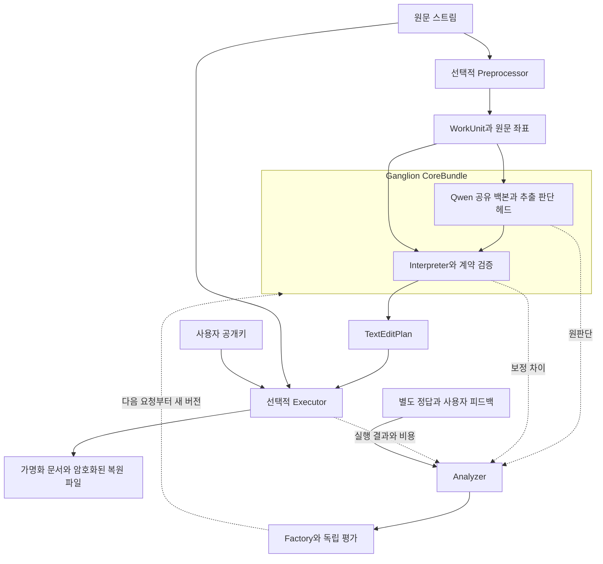

# 긴 문서 개인정보 가명화 모델 파이프라인 설계

상태: 구현 계획 · 작성일: 2026-10-08

긴 한국어 및 다국어 문서를 입력받아 개인정보를 가명으로 치환하고, 사용자 키로 원문을 정확히 복원할 수 있는 프로그램을 만든다. 학습과 실험은 로컬 H100에서 수행하고, 배포 목표는 아이폰급 기기의 오프라인 실행이다. 주 베이스 모델은 `Qwen/Qwen3.5-0.8B`이며, 하나의 언어 백본이 구간 추출과 유형 판단을 공유한다.

Ganglion 코어는 계약, 형식언어모델, Interpreter, 피드백 기반 개선을 담당한다. 문서 전처리와 실제 편집·암호화·복원은 선택적 어댑터 스펙으로 연결한다. 외부 프로그램은 코어만 호출하거나, 어댑터를 포함한 전체 애플리케이션을 사용할 수 있다. 일반 구조는 [아키텍처 v2](architecture_v2.md)를 따른다.

## 1 목표와 처리 범위

첫 버전의 대상은 `PERSON`, `ADDRESS`, `PHONE`, `EMAIL`, `IDENTIFIER`의 다섯 유형이다. `IDENTIFIER`는 주민등록번호 형태의 식별번호로 시작한다. 계좌번호, 의료정보, OCR 및 PDF 레이아웃 보존은 후속 범위로 둔다. 입력은 UTF-8 일반 텍스트 파일 또는 스트림이며, 작업 단위는 한국어, 영어, 한영 혼합 문맥을 지원한다.

복원 보장은 시스템이 출력한 문서를 수정하지 않은 경우의 **원문 바이트 완전 일치**다. 동일 문서에서 같은 유형의 동일 문자열에는 같은 가명을 부여한다. 동명이인을 구별하거나 다른 표기의 같은 인물을 연결하는 의미적 동일성 추론, 문서 간 연결, 사용자가 수정한 문서의 복원은 첫 버전의 보장에 포함하지 않는다.

사용자에게 제공하는 결과는 가명화 문서, 암호화된 복원 파일, 버전과 처리 상태를 담은 manifest다. 복원이 가능한 처리는 가명화이며, 개인정보 누락이나 간접 식별 가능성까지 제거했다는 익명성 보장과 구분한다.

## 2 코어와 선택적 어댑터

| 구성 요소 | 입력 | 출력 | 책임 |
|---|---|---|---|
| Preprocessor 어댑터 | 문서 스트림과 입력 스펙 | `WorkUnit` 스트림 | 문서 분할, 문맥 제공, 원문 위치 대응, 규칙 후보 제공 |
| 형식언어모델 | `WorkUnit`의 모델 입력과 판단 계약 | `ModelObservation` | 구간 및 유형별 판단 점수 출력 |
| Interpreter | 원판단, 원문 좌표, 문맥 상태, 정책 | `TextEditPlan`과 상태 | 해석, 확률 보정 적용, 경계·충돌 보정, 정책 결정, 계약 재검증 |
| Executor 어댑터 | 편집 계획과 원문, 사용자 공개키 | 결과 패키지 | 가명 할당, 편집 실행, 복원 정보 암호화, 최종 검증 |
| Analyzer와 Factory | trace, 별도 정답, 배포 목표 | 검증된 새 코어 또는 어댑터 개선 제안 | 실패 귀속, 규칙 개선, 학습 후보 제작, 독립 평가 |

Preprocessor를 생략하면 호출자가 계약에 맞는 `WorkUnit`과 위치 정보를 제공한다. Executor를 생략하면 코어는 편집 계획과 처리 상태만 반환한다. 도메인의 정답 의미와 편집 연산의 의미는 필수 계약이며, 어댑터 구현과 파일 저장 설정은 선택 사항이다.

`CoreBundle`은 계약, 토크나이저, 모델·헤드·adapter, Interpreter 정책, 확률 보정 파라미터와 런타임 참조를 묶는다. `ApplicationBundle`은 CoreBundle에 선택적 어댑터와 설정을 연결한다. 문서 하나를 처리하는 동안 두 번들의 버전을 고정한다. 실행 도중 규칙이나 가중치를 갱신하지 않는다.



## 3 모델 구성

### 3.1 베이스 모델과 비교 후보

주 모델 `Qwen/Qwen3.5-0.8B`는 Apache 2.0이며, 공식 모델 카드는 언어 모델 크기를 0.8B로 명시하고 작업별 미세조정을 주요 용도로 제시한다. 모델은 causal 구조와 vision encoder를 갖는다. 이 실험은 텍스트 백본만 사용하며, 배포 산출물에서 이미지 처리 구성 요소의 제외를 검증한다. 한국어 개인정보 성능은 자체 평가로 확인한다. [Qwen 모델 카드](https://huggingface.co/Qwen/Qwen3.5-0.8B)

`Qwen/Qwen3.5-2B`는 동일 계열에서 크기에 따른 품질 차이를 측정하는 비교군이다. `LiquidAI/LFM2.5-1.2B-Instruct`는 한국어를 지원하는 온디바이스 지향 모델로 모바일 효율을 비교한다. LFM의 라이선스는 별도 `lfm1.0`이다. Laya와 GLiNER는 기존 방식과의 비교에 사용하고, 주 배포 후보는 하나의 Qwen 백본을 유지한다. [Qwen 2B](https://huggingface.co/Qwen/Qwen3.5-2B), [LFM2.5](https://huggingface.co/LiquidAI/LFM2.5-1.2B-Instruct)

### 3.2 형식화된 직접 출력

배포 목표 경로는 다음과 같다. 아래 헤드는 새로 학습·구현할 구성 요소다.

```text
입력 토큰
  → Qwen 텍스트 백본의 한 번의 forward
  → 작은 문맥 결합 readout
  → BIO 구간 헤드 + 문자 경계 보정 + 구간 유형 판단 헤드
  → 코드가 ModelObservation 구성
  → Interpreter
```

BIO 헤드는 각 토큰에 개인정보 구간의 시작·내부·외부와 유형을 예측한다. 유형 판단 헤드는 제안된 구간과 문맥의 표현을 모아 다섯 개인정보 유형 및 `NOT_PII`의 점수를 출력한다. 정규식에서 제공한 후보도 같은 유형 판단 경로에 넣을 수 있다. 첫 readout 후보는 폭 128의 작은 양방향 attention 층 1개이며, 추가 비용과 품질을 제거한 구성과 비교한다.

토큰 하나에 이름과 조사가 함께 들어가면 BIO만으로 정확한 원문 경계를 표현할 수 없다. 시작·끝 토큰의 원문 문자 경계를 선택하는 작은 boundary head를 추가 후보로 두고, 같은 백본 표현과 문자 정보를 사용한다. 첫 prototype에서는 명시적인 조사·존칭 보정도 비교한다. 유효한 UTF-8 문자 경계만 허용하며, 토큰화로 표현할 수 없는 정답을 임의로 넓혀 학습 정답을 바꾸지 않는다. 확정하지 못한 경계는 검토 상태로 남긴다.

Qwen의 causal 토큰 표현은 뒤쪽 문맥을 직접 보지 못하므로, BIO 헤드만 붙이면 뒤에 나오는 조사·설명에 의존하는 판단이 약해질 수 있다. readout이 작업 단위 안의 앞뒤 표현을 결합하도록 학습하고, 미래 문맥이 필요한 사례를 따로 평가한다. 백본의 attention mask를 임의로 바꾸지 않는다.

직접 출력 경로에서는 JSON과 원문을 자동회귀적으로 생성하지 않는다. 구간과 확률을 코드로 직렬화하므로 생성 출력 토큰은 0이다. 입력 forward, 헤드 계산, 후보 수, 겹친 문맥의 반복 처리 비용은 그대로 측정한다. 유형 확률은 보정 데이터로 temperature scaling 등을 적용하고, 구간 경계 정확도와 조건부 유형 정확도를 별도로 보고한다. 토큰 확률을 단순히 곱한 값을 구간 정답 확률로 사용하지 않는다.

비교 경로는 같은 Qwen이 짧은 구간 DSL을 생성하고 Interpreter가 해석하는 방식이다. 이 경로에는 생성 토큰·디코딩·재시도 비용이 발생한다. 직접 출력 경로와 같은 정답, 학습 데이터, 공통 편집 계획을 사용해 출력 구조의 기여를 분리한다.

### 3.3 규칙과 모델의 역할

Preprocessor는 전화번호·이메일·식별번호의 후보를 규칙으로 제공하고, Interpreter는 근거와 문맥에 따라 처리한다. 형식 검증 실패만으로 개인정보 후보를 버리지 않는다. 잘못 적힌 개인정보도 처리 대상이 될 수 있다.

모델은 첫 버전에서 **모든 문서 작업 단위**를 검사한다. 정규식이 찾은 전화번호를 처리했다고 다른 이름·주소까지 없다고 가정해 작업 단위를 건너뛰지 않는다. 규칙은 구간 처리와 판단을 줄일 수 있지만, 문서 단위 모델 호출 절감은 별도 gate의 누락률을 검증한 이후에 평가한다.

## 4 입력 판단 실행 계약

| 타입 | 주요 필드 | 제약 |
|---|---|---|
| `WorkUnit` | job/document/unit ID, contract/bundle 참조, 문맥 텍스트, 토큰과 원문 대응, 규칙 후보 | 실제 전달 토큰 수 제한, 원문 위치 검증 |
| `ModelObservation` | unit ID, 후보 구간, 유형 점수, 경계 신호, 보정 버전 | 좌표 범위, 유형 집합, 유한한 점수, raw와 보정값 구분 |
| `TextEditPlan` | 원문 구간, 확정 유형, 연산, 규칙 ID, 미해결 구간, 확정 가능 위치 | 편집 구간 비중첩, 원문 UTF-8 경계, 보정 후 재검증 |
| `ExecutionReceipt` | plan ID, 출력 위치, 상태, 비용, 실패 원인 | 작업 단위 재실행 중복 방지, 번들 호환성 |
| `ResultManifest` | application/core/contract 참조, 산출물 참조, 상태, 복원 형식 | 완료된 두 산출물의 대응 및 무결성 확인 |

원문 좌표는 UTF-8 바이트의 반개구간 `[start, end)`으로 통일한다. 토크나이저 좌표와 Unicode 문자 좌표는 Preprocessor의 대응 정보로 변환한다. 원문은 공백, 개행, Unicode 정규화 형태를 보존하며, 모델용 변환을 사용하면 원문 대응을 명시한다. 모델이 임의로 생성한 숫자를 검증 없이 파일 위치로 사용하지 않는다.

원문이 `김민수님께 연락하세요.`일 때의 판단 예시는 다음과 같다. 확률은 형식 설명용 수치이며 성능 측정값이 아니다. ID와 버전은 런타임이 붙인다.

```json
{
  "unit_id": "unit-0001",
  "coordinate_system": "utf8_bytes",
  "candidates": [{
    "source_span": [0, 9],
    "type_probabilities": {
      "PERSON": 0.93,
      "ADDRESS": 0.01,
      "PHONE": 0.01,
      "EMAIL": 0.01,
      "IDENTIFIER": 0.01,
      "NOT_PII": 0.03
    }
  }]
}
```

Interpreter는 이 판단을 `replace([0, 9), PERSON)` 같은 의미 계획으로 변환한다. 실제 `<PERSON_1>` 문자열과 암호화 매핑은 Executor가 만든다. 원문·가명·복원 키를 모델이 생성하거나 보관하도록 하지 않는다.

코어 상태는 `ready`, `needs_review`, `invalid`를 사용한다. Executor는 이를 `complete`, `needs_review`, `failed`의 문서 상태로 집계한다. 미해결 구간이 있는 문서를 자동 완료로 표시하지 않는다. 형식 유효성은 의미적 정답이나 완전한 개인정보 제거를 보장하지 않는다.

## 5 긴 문서 처리

### 5.1 입력 분할과 확정

기본 작업 단위는 입력 전체 기준 최대 1,024토큰이며, 인접 작업 단위의 겹침은 128토큰으로 시작한다. 고정 계약이 학습된 직접 출력 경로는 긴 스키마를 반복 전달하지 않는다. 프롬프트를 사용하는 비교 경로도 스키마를 포함해 같은 전체 토큰 예산을 지킨다. 512토큰 구성과 겹침 64·128·256토큰의 품질·비용을 개발 데이터에서 비교한다.

Preprocessor는 문장·줄 경계를 우선하되, 긴 단일 줄에서도 제한을 넘지 않게 분할한다. 각 작업 단위는 문맥 범위와 주 담당 범위를 가진다. Interpreter의 문서 reducer는 이웃 작업 단위의 중복 판단과 중첩 구간을 합치며, 경계 충돌은 다시 판단하거나 `needs_review`로 남긴다. 주 담당 범위만 단순 채택해 경계를 넘는 개인정보를 잘라내지 않는다.

이웃 판단이 확인된 안전한 원문 prefix만 확정한다. 작업 단위 끝에 닿는 열린 구간은 보류하고 다음 문맥으로 확장한다. 보류 한도를 넘는 긴 주소·불확실한 구간은 조용히 원문으로 내보내지 않고 검토 상태로 전환한다. 문서 종료 시 남은 구간을 처리한 뒤 최종화한다. 입력 분할 구현은 Preprocessor 어댑터로 교체하고, 판단 병합의 의미와 reducer는 도메인 Interpreter 정책으로 관리한다. 원문 좌표와 편집 의미 계약은 유지한다.

### 5.2 메모리와 문서 상태

Application runner가 작업 단위 반복, backpressure, 취소, 임시 파일과 완료 처리를 관리한다. Interpreter는 명시적인 상태 snapshot을 받아 계획과 상태 변경 제안을 반환한다. Executor가 편집 cursor, 가명 사전, 실행 receipt를 관리한다. 사용자 키를 일반 공유 context에 넣지 않는다.

원문·출력 전체와 전체 토큰 배열을 메모리에 쌓지 않는다. 모델은 작업 단위마다 문맥을 종료하고, 앞선 모든 문서 토큰의 cache를 유지하지 않는다. 겹친 문맥은 재처리하며 그 비용을 기록한다. 많은 가명에 대한 조회는 문서별 비밀키로 만든 lookup 식별자와 암호화 저장소를 이용하고 메모리 cache의 크기를 제한한다. 원문 문자열의 평문 사전이나 비밀키 없는 단순 hash를 영속 저장하지 않는다.

모델 작업 메모리는 문서 길이에 비례해 증가하지 않도록 제한한다. 처리 시간, 결과 크기, 가명 사전 및 복원 파일의 디스크 사용량은 문서 길이와 개인정보 수에 따라 증가한다. 멀리 떨어진 문맥에 의존하는 식별은 국소 분할만으로 해결된다고 가정하지 않으며 별도 평가 slice와 검토 정책을 둔다.

## 6 편집 실행과 복원

### 6.1 편집 기록

Executor는 확정된 편집을 원문 순서대로 적용한다. 개인정보 이외의 바이트는 그대로 복사한다. 문서별 가명은 예를 들어 `<PERSON_1>` 형식을 사용하며, 원문에 같은 토큰이 이미 있어도 복원은 토큰 검색·치환 대신 **출력 위치에 대응한 편집 기록**으로 수행한다.

각 복원 record에는 원문 구간, 출력 구간, 원래 바이트, 가명과 유형을 담는다. 마지막 record는 출력 파일 digest, 원문 digest, 총 편집 수, 형식 버전을 포함한다. 원문 digest와 편집 record는 암호화 영역에 둔다. 복원은 출력 무결성과 편집 구간을 확인한 후 순서대로 원래 바이트를 복사·재삽입하고, 마지막 원문 digest를 검사한다.

### 6.2 암호화와 키

첫 암호화 후보는 검증된 libsodium의 `secretstream_xchacha20poly1305`다. 복원 record를 순차 암호화하고 인증하며, 문서마다 새 대칭키를 생성한다. 이 키는 사용자 공개키에 대한 sealed box로 봉인하고 복원 파일에 저장한다. 사용자 비밀키는 실행 입력이나 trace에 포함하지 않는다. [libsodium secretstream](https://libsodium.gitbook.io/doc/secret-key_cryptography/secretstream), [sealed boxes](https://libsodium.gitbook.io/doc/public-key_cryptography/sealed_boxes)

어댑터는 종료 tag를 필수로 확인하고, 버전과 document/job 참조를 인증되는 데이터에 연결한다. 다른 출력 문서와의 조합, record 누락·재배열·변조, 잘못된 키를 복원 실패로 처리한다. 실패한 복원의 임시 원문은 최종 결과로 공개하지 않는다. sealed box는 수신자 키로 암호화하지만 송신자 신원을 인증하지 않으므로, 배포 산출물의 출처 인증은 별도 요구일 때 추가한다.

이 설계는 저장된 복원 파일을 사용자 키 없이 해독하지 못하도록 한다. 처리 중에는 원문과 대칭키가 로컬 프로세스에 존재한다. 기기나 실행 프로세스가 침해된 경우까지 보호한다고 가정하지 않는다. 키 보관·백업·분실 정책은 사용자 앱의 책임이며, 사용자 공개키 참조만 Executor 설정에 전달한다.

### 6.3 최종화와 실패 처리

문서와 복원 파일을 임시 작업 디렉터리에 쓰고, 두 파일 및 최종 인증 record가 완료된 뒤 manifest를 통해 패키지를 공개한다. 여러 파일의 개별 저장을 원자적이라고 가정하지 않는다. `complete` manifest가 없으면 완료 결과로 읽지 않는다. `needs_review` 산출물은 검토용이며 자동 완료 결과와 분리한다.

문서 내부 재시도는 동일 plan ID의 execution receipt로 중복 편집을 막는다. 첫 버전의 프로세스 중단 복구는 미완료 작업을 정리하고 새 job과 새 암호화키로 처음부터 다시 실행한다. 암호화 스트림 중간 재개는 별도의 checkpoint 계약을 구현한 뒤 제공한다.

최종 패키지의 논리적 형태는 다음과 같다.

```text
result/
  document.txt       가명화된 문서
  recovery.bin       봉인된 문서키와 인증된 복원 스트림
  manifest.json      상태와 버전 및 파일 참조
  review.json        검토 필요 시 원문 없는 구간 참조
```

## 7 학습과 피드백 개선

### 7.1 초기 학습

200문서의 별도 예비 데이터로 기본 Qwen의 생성형 추출 능력, 토크나이저와 원문 대응, native 헤드 및 모바일 변환 가능성을 확인한다. 미학습 헤드의 점수를 모델 성능으로 평가하지 않는다. 본 초기 학습은 정답 구간을 토큰 label로 투영하고, 구간 유형 정답으로 헤드를 학습한다. 부정 후보와 개인정보 없는 문서를 포함한다.

H100에서 BF16 백본과 새 헤드, LoRA adapter를 학습한다. 손실은 토큰 BIO 및 구간 유형 분류 손실로 시작하고, boundary head를 쓰면 문자 경계 정답을 추가한다. 토큰 내부에서 끝나는 span은 BIO에 걸친 토큰을 표시하되 최종 문자 경계 정답을 별도로 보존한다. 유형별 누락·과잉 처리에 따라 개발 데이터에서 조정한다. 원문 재생성이나 복원 loss는 사용하지 않는다. 범용 모델 가중치, tokenizer, readout, adapter, 데이터 split과 seed를 기록하고 모델 학습은 3개 seed로 비교한다.

### 7.2 규칙 개선 실험

초기 학습과 확률 보정 후 체크포인트를 고정한다. 200문서씩 세 번의 피드백으로 경계 보정, 문맥 판정, 충돌 처리, 임계값 정책을 개선한다. 후보 생성 누락, 모델 오판, Interpreter 회귀, Executor 오류, 분할 경계 오류를 구분한다. 원문 밖으로 구간을 확장한 제안은 좌표 검증과 재평가를 통과해야 한다.

각 변경은 개발 trace의 근거, 적용 범위, rescue와 regression, 비용을 기록한다. 분석기의 규칙 confidence와 모델 정답 확률을 같은 값으로 취급하지 않는다. 새로운 도메인 정답 의미는 사용자의 계약 변경으로만 반영하고, 품질 향상을 위해 정답 정의를 바꾸지 않는다.

규칙 제안은 검증 데이터에서 기존 정답을 망친 사례까지 평가한 뒤 새 버전으로 반영한다. 다음 단계에서 검증된 피드백을 학습 데이터로 환류해 헤드·LoRA를 갱신하고, 모델이 흡수한 규칙의 제거 효과를 비교한다. 이 단계의 이득은 고정 모델 규칙 실험과 분리해 보고한다.

### 7.3 기록과 정답의 분리

일반 trace에는 버전, 구간 참조, raw/보정 판단, 적용 규칙, 실행 상태, 비용을 저장한다. 원문, 복원 키와 평문 매핑은 저장하지 않는다. 상세 검토가 필요하면 별도 암호화된 개발 데이터 저장소의 접근 권한으로 연결한다. 구간·유형 메타데이터도 민감할 수 있으므로 보존 기간과 접근 정책을 가진다.

정답은 별도 `LabelRecord`와 데이터셋에 둔다. 문서 처리 프로세스에는 정답을 전달하지 않는다. 실행 성공이나 형식 통과를 개인정보 판단의 정답으로 사용하지 않는다.

## 8 실험 설계와 성공 지표

### 8.1 데이터와 비교군

본 데이터는 3,000문서로 시작한다. 한국어 70%, 영어 15%, 한영 혼합 15%를 목표로 하며, 개인정보가 없는 문서·조사 결합·부분 주소·반복 등장·오탈자·가명과 같은 원문 문자열·Unicode 경계를 포함한다. 합성 원문과 자동 삽입 구간을 바탕으로 정답을 검수한다. 모호한 경계·유형은 이중 검수와 합의로 확정한다. 합성 데이터 성과는 실제 업무 문서 성능과 구분한다.

| split | 문서 수 | 사용 |
|---|---:|---|
| 초기 학습 | 600 | native 헤드·LoRA 및 생성형 비교군 학습 |
| 피드백 | 600 | 200문서씩 세 번의 규칙 개선 |
| 확률 보정 | 300 | 유형 확률 보정 |
| 개발 검증 | 500 | 규칙 채택, 임계값 및 구성 선택 |
| 최종 평가 | 1,000 | 후보와 평가 절차를 동결한 후 평가 |

split은 문서와 템플릿 계열 단위로 분리한다. 같은 문서의 조각이나 같은 템플릿의 값 교체 사례가 split을 넘지 않게 한다. 개발 검증의 반복 사용으로 생기는 선택 편향은 독립 최종 평가로 확인한다. 최종 평가 결과를 보고 설정을 고쳤다면 기존 결과와 구분하고 새 독립 평가가 필요하다.

추가 긴 문서 평가에는 4k·32k·256k 입력 토큰 길이별 10문서를 사용한다. 새로운 템플릿 계열에 개인정보를 문서 앞·중간·끝, 분할 경계 및 긴 주소에 배치한다. 짧은 문서를 이어붙여 문서별 가명 사전이 초기화되는 방식으로 긴 문서 성능을 대체하지 않는다. 필요한 경우 길이·고유 개인정보 수를 독립적으로 늘려 메모리를 측정한다.

| 조건 | 역할 |
|---|---|
| 규칙만 | 모델 없는 비용·누락 기준선 |
| Presidio와 한국어 인식기 구성 | 기존 프로그램 비교; 기본 영어 설정만으로 한국어를 평가하지 않음 |
| Qwen 생성형 DSL과 고정 Interpreter | 직접 출력 구조의 기여 비교 |
| Qwen native 출력과 고정 Interpreter | 주 모델의 초기 기준선 |
| 같은 native 모델과 수동 규칙 갱신 | 같은 피드백 문서와 인력 시간 예산의 비교 |
| 같은 native 모델과 Ganglion 규칙 갱신 | 고정 가중치에서 개선 루프의 기여 |

규칙 개선 비교는 모델·초기 정책·split·Executor·장치를 공유한다. 생성형과 native 비교는 같은 베이스와 학습 예산을 사용하고 실제 학습량을 함께 보고한다. Presidio의 인식기와 처리 정책, 사람이 작성한 코드의 시간을 기록한다. 입력 어댑터를 바꾸는 실험은 동일 어댑터 실험과 별도 ablation으로 보고한다.

### 8.2 품질과 비용

| 지표 | 정의 |
|---|---|
| 개인정보 잔존 문서율 | 정답에서 제거 대상으로 정한 정보 문자가 하나라도 남은 문서 비율; 부분 주소 누락 포함 |
| 유형별 span precision/recall/F1 | 원문 구간과 유형의 완전 일치; 부분 일치 진단 별도 |
| 과잉 마스킹 비율 | 정답 개인정보 밖에서 치환된 원문 문자 비율 |
| 자동 완료율과 검토율 | 전체 요청에서 각 상태의 비율; 실패·보류 문서를 숨기지 않음 |
| 원문 완전 복원율 | 완료 문서의 복원 바이트와 원문 완전 일치; 분모와 완료율 함께 보고 |
| rescue와 regression | 동일 문서의 오답→정답 및 정답→오답 변화와 규칙별 귀속 |
| 확률 보정 | 유형 판단의 ECE/Brier, 위험 대비 자동 완료율; span 제안 누락은 별도 |
| 실행 비용 | 입력·생성 토큰, 반복 forward, 후보 수, CPU/GPU 시간, 모델 호출, p50/p95, 처리량 |
| 장치 비용 | 모델 파일 크기, 최대 앱 메모리, 디스크, cold load, 연속 처리의 발열·속도 저하 |
| 개선 비용 | 초기 학습과 round별 GPU 시간, 정답 검수·규칙 작성 시간, 검증 비용 |

개인정보 잔존율은 전체 요청의 실패·검토 상태와 함께 보고하고, 자동 완료 문서의 잔존율도 따로 표시한다. 모든 문서를 보류해 품질을 높인 것으로 판정하지 않는다. F1이 높아도 문서별 잔존이 높으면 실패다. 문서 길이·유형·언어별 slice와 템플릿 계열을 고려한 paired 신뢰구간을 보고한다.

주 가설은 고정 모델 대비 자동 완료율과 과잉 마스킹을 악화시키지 않으면서 잔존 문서율을 낮추는 것이다. 비용 가설은 같은 품질 조건에서 처리 지연 또는 모델 계산량을 낮추는 것이다. 과잉 마스킹·완료율의 허용 차이와 통계 판정은 예비 데이터 후 최종 평가 전에 고정한다. 표본이 부족하거나 기준선이 이미 포화됐으면 이득을 단정하지 않는다. 1,000건에서 잔존 0건이어도 모든 문서에 대한 무누락 보장은 아니다.

실행 기능의 필수 조건은 완료 문서 100% 바이트 복원과, 잘못된 키·다른 문서·변조·잘린 복원 파일의 명시적인 실패다. 반복 등장, 원문 가명 토큰, 겹친 구간, 개행·이모지·결합 문자, 중단된 실행을 별도 기능 사례로 검증한다.

## 9 모바일 배포 계획

아래 수치는 초기 목표 예산이며 측정 성능이나 특정 아이폰의 보장치가 아니다. 실제 검증 기종·OS·런타임·정밀도를 `DeploymentProfile`에 고정한 뒤 모바일 통과를 판정한다.

| 항목 | 초기 목표 |
|---|---|
| 모델 패키지 | 텍스트 백본·헤드·tokenizer 포함 1GB 이하 |
| 최대 앱 메모리 | 1.5~2GB 이하를 시작 예산으로 설정 |
| 정밀도 | 4비트 백본 후보, 헤드 고정밀 후보; 양자화 전후 품질 비교 |
| 작업 단위 | 최대 1,024토큰, 512토큰 프로파일 별도 |
| warm 처리 지연 | 512토큰 작업 단위의 전체 처리 p95 1초 이내 |
| 실행 | 네트워크 없는 로컬 추론·편집·복원 |

0.8B를 전부 4비트로 저장하는 단순 계산은 약 400MB지만, 실제 파일·메모리는 양자화 metadata, tokenizer, 고정밀 파라미터, 임베딩, 추론 상태와 버퍼를 포함한다. 출력 투영과 토큰 임베딩이 공유되면 출력 헤드 제거만으로 해당 가중치가 사라지지 않는다. 전체 문서 지연은 작업 단위 수에 따라 증가하므로 1초 목표를 긴 문서 전체 완료 시간으로 사용하지 않는다.

모바일 실행의 첫 검증 경로는 llama.cpp의 GGUF·Metal과 공식 iPhone 예제다. 이는 일반 모델의 실행 경로이며, custom readout·BIO·유형 헤드의 자동 지원을 뜻하지 않는다. 별도 graph·헤드 구현 또는 Core ML 변환을 검증하고, Qwen hybrid 연산의 지원·fallback·실제 비용을 초기에 확인한다. [llama.cpp iPhone 예제](https://github.com/ggml-org/llama.cpp/blob/master/examples/llama.swiftui/README.md)

대규모 학습 전에 작은 native 모델을 export하고 H100/CPU 결과와 구간·logit을 비교한다. 양자화는 LoRA merge와 tokenizer 고정 후 수행하고, 보정 파라미터는 배포 정밀도의 별도 보정 데이터에 맞춘다. 확률 보정 이후의 최종 품질과 변환 후 품질을 다시 평가한다. custom 경로가 막히면 생성형 DSL 경로를 임시 실행 대안으로 두되 native 모바일 달성으로 보고하지 않는다.

H100의 속도나 CPU RAM 제한 실험으로 아이폰 지연·발열을 추정해 통과시키지 않는다. 실제 기기에서 cold/warm, batch 1, 파일 I/O와 암호화 포함 비용, 10분 연속 처리, 긴 문서 최대 메모리와 오류를 측정한다. 모바일 통과 자료가 없으면 H100 설계 검증과 구분해 상태를 남긴다.

## 10 어댑터 스펙 예시

아래 YAML은 새 인터페이스의 설정 제안이다. 현재 CLI에서 동작하는 설정 파일이 아니다. 참조는 실제 번들 제작 시 불변 artifact hash로 해석한다. 어댑터 이름은 등록된 구현을 가리키며 임의 코드를 설정에서 자동 다운로드·실행하지 않는다.

```yaml
application:
  id: reversible-pii-text
  revision: 1
core:
  contract: pii-text-v1
  base_model: Qwen/Qwen3.5-0.8B
  output_backend: native_heads
  interpreter: pii-policy-v1
  calibration: pii-calibration-v1
preprocessor:
  adapter: utf8-document-chunker-v1
  input_schema: utf8-document-stream-v1
  output_schema: pii-work-unit-v1
  config:
    max_input_tokens: 1024
    overlap_tokens: 128
    coordinate_system: utf8_bytes
    normalization: preserve_source
executor:
  adapter: reversible-text-editor-v1
  input_schema: text-edit-plan-v1
  output_schema: reversible-document-result-v1
  config:
    mapping_scope: document
    unresolved_policy: needs_review
    recovery_format: sodium-secretstream-v1
    recipient_public_key_ref: user-key-reference
deployment:
  training_device: local-h100
  target_profile: iphone-class-to-be-measured
  precision_candidate: int4
```

단계별 스펙에는 입력·출력 schema, 버전, 실패 상태, 상태 소유자, 비용 신호를 정의한다. 개인키 값은 YAML에 넣지 않는다. Preprocessor와 Executor를 생략해도 코어의 판단·편집 의미는 동일하다.

## 11 구현 순서와 완료 조건

| 단계 | 구현 | 완료 조건 |
|---|---|---|
| A 계약과 결정적 실행 | WorkUnit/Observation/Plan, Executor와 복원 형식 | 정답 편집 계획을 넣었을 때 완전 복원, 충돌·변조·중단 처리 |
| B 긴 문서 처리 | 전처리 어댑터의 원문 대응·분할, Interpreter reducer, 제한된 상태와 임시 파일 | 개인정보를 모든 분할 위치로 이동해 경계 오류 검증; 길이를 늘려 메모리 측정 |
| C 베이스와 native 경로 | Qwen 로딩, 토크나이저 대응, 작은 readout·헤드와 export prototype | 실제 모바일 런타임의 연산 가능성 및 변환 전후 결과 확인 |
| D 초기 특화 | 헤드·LoRA 학습, 확률 보정, 생성형/기존 시스템 비교 | 고정 split·3 seeds·모델과 계산량 기록; 초기 품질 보고서 |
| E Ganglion 개선 루프 | trace, 별도 라벨, 규칙 제안·검증·버전 적용 | 고정 가중치 3 rounds, 수동 갱신 비교, rescue/regression 귀속 |
| F 모바일 패키지 | merge, 양자화, 런타임·어댑터 번들 | 배포 정밀도 재평가, 실제 기기 품질·지연·메모리·복원 통과 |
| G 독립 최종 평가 | 동결 번들과 긴 문서 평가 | 최종 1,000문서 및 stress 결과와 CI, 모든 비용·미해결 상태 보고 |
| H 학습 환류 | 검증 피드백으로 재학습, 규칙 제거 비교 | 고정 모델 개선과 별도의 추가 이득·회귀·학습 비용 보고 |

기존 `contract`의 타입·validator 경계, `lm`의 backend·학습 기능, `analyzer`의 trace·라벨·비교·규칙 제안 구조를 재사용한다. 현재 tool-calling 전용 타입과 패치 적용기는 그대로 PII에 적용하지 않고, `TextEditPlan` 및 PII 정책 adapter를 추가한다. 개인정보 도메인 구현은 `ganglion/domains/pii/`, 선택적 실행 구현은 `ganglion/adapters/`, 재현 데이터는 `examples/pii/`, 결과는 `runs/pii/`를 목표 위치로 삼는다. 해당 디렉터리는 기능 구현과 함께 만든다.

실험 산출물에는 split manifest, 모델·계약·어댑터 hash, 학습 recipe, tokenizer, seed, device/runtime/precision, raw 및 보정 품질, 규칙별 변화, 복원 결과와 실제 장치 비용을 포함한다. 명시된 목표를 만족하지 못한 구성도 실패 원인과 함께 보존한다.

## 12 구현 현황 (2026-10-08)

첫 실증의 실행 가능한 프로토타입을 구축했다. `ganglion/programs/`가 데이터로 선언한 ApplicationSpec을 검증하고 UI/CLI 공통 `/api/v2`에 프로그램·작업·결과 파일·피드백을 제공한다. `web/index.html`은 밝은 배경과 입력/결과 영역을 사용하는 새 작업 공간이며, 도구 호출과 개인정보 프로그램을 같은 schema 기반 화면에서 전환한다. 기존 분석기와 CLI 명령도 유지한다. 실행 방법은 README 및 생성된 CLI 레퍼런스에 기록한다.

Preprocessor는 코어 밖의 선택적 **버전 있는 스펙**이다. 긴 문서를 모델에 통째로 넣지 않으며, 분할·모델 입력 예산은 프로그램 계약에 고정한다. 기본 Qwen 프로그램은 다음 설정을 사용한다.

```json
{
  "adapter": "utf8-windows",
  "version": 1,
  "config": {
    "strategy": "semantic",
    "max_chars": 256,
    "overlap_chars": 64,
    "max_tokens": 128
  }
}
```

문단 하나를 순서대로 전달하고, 문단이 예산보다 클 때는 문장·행 경계를 찾는다. 자연스러운 경계에서는 중복 없이 확정하며, 경계를 찾지 못해 강제로 자를 때만 overlap을 유지한다. 버퍼와 각 모델 입력을 제한하고 정규화 없이 원문 문자 위치를 보존한다. 한국어/영어, LF/CRLF, 결합 문자와 이모지의 바이트 대응을 테스트한다. 개인정보 자체가 구간보다 길거나 문장 경계를 가로지르는 경우까지 탐지 재현율을 보장하지 않는다. 구간 병합·중복 제거 및 익명화·복원 실행을 별도로 검증한다.

기본 `pii-rules`는 비교용 고정 1,024자/128자 overlap 정책을 선언한다. 문자열 형태의 기존 `utf8-windows` alias는 호환 경로로 남긴다. 새 object 스펙의 예산을 요청 입력으로 바꾸는 것은 거부한다. Preprocessor를 생략하면 문서를 쪼개지 않는 제한된 코어 입력을 받고, 초과 길이는 잘라 버리지 않고 거부한다. Executor를 생략하면 키 없이 개인정보 없는 `plan.jsonl`을 반환한다.

실행 결과는 가명화 문서, 공개 UTF-8 바이트 편집 계획, 원문 없는 raw/Interpreter trace, 암호화 복원 파일이다. 복원은 X25519 sealed key와 XChaCha20-Poly1305 secretstream을 사용한다. 사용자 개인키와 원문은 job metadata/PII trace에 쓰지 않는다. 임시 원문은 성공·실패·취소 후 삭제하며, 비정상 종료의 잔여 파일은 다음 writer runtime이 회수한다. 복원 결과인 평문은 사용자가 요청한 별도 artifact로 보관되므로 이용 후 삭제 대상이다. 실행 중인 계약과 결과 schema, 체크포인트 fingerprint를 고정한다. 진행 중인 웹 서버와 CLI는 `GANGLION_CONSOLE_URL`로 같은 runtime을 이용한다.

모델은 Qwen3.5-0.8B의 text backbone **752,393,024 parameters**를 고정하고, 작은 bidirectional readout와 BIO/type heads **265,873 parameters**만 학습했다. Head 파일은 **1,065,132 bytes**이다. 생성형 JSON 출력 대신 구간/유형 분포를 직접 읽으며 점수는 아직 보정하지 않은 확률이다. 학습 recipe는 seed 42, 합성 학습 1,008개, 20 epochs, AdamW, train-template/validation-template/test-template 분리이다. Qwen revision은 `2fc06364715b967f1860aea9cf38778875588b17`로 고정한다. validation/test 각각 252개에서 Interpreter 후 exact-span F1은 각각 0.8621/0.8610이었다.

같은 가중치와 같은 89,989-byte 긴 문서에 분할 스펙만 바꾸어 비교했다. 문서는 test-template 합성 record 1,008개를 원문 좌표 gold와 함께 연결했다. 결과 JSON은 `runs/pii/streaming-report.json`, 재현 명령은 `python tools/benchmark_pii.py`이다.

| 구성 | 모델 호출 구간 | 입력 토큰 | 생성 토큰 | exact-span F1 | precision / recall | 처리 시간 | 정확한 바이트 복원 |
|---|---:|---:|---:|---:|---:|---:|---|
| 규칙 + 고정 분할 | 69 | 해당 없음 | 0 | 1.0000 | 1.0000 / 1.0000 | 0.074초 | 통과 |
| Qwen + 고정 1,024자 분할 | 69 | 31,219 | 0 | 0.5430 | 0.4650 / 0.6523 | 38.00초 | 통과 |
| 같은 Qwen + 문단 순차 분할 | 1,008 | 27,277 | 0 | 0.8628 | 0.7586 / 1.0000 | 79.31초 | 통과 |

문장 단위로 학습한 head에 서로 다른 문단을 한 고정 창으로 묶어 넣으면 품질이 떨어졌다. 학습 가중치를 바꾸지 않고 Preprocessor가 학습 입력 형식에 맞는 단위를 제공하자 품질이 회복됐다. 겹침 중복이 줄어 입력 토큰은 약 12.6% 감소했지만, 이 Python/H100 구현에서는 작은 입력에 대한 반복 호출 비용으로 지연은 증가했다. 효율 개선을 증명한 결과로 해석하지 않는다. 측정 GPU는 H100 PCIe, BF16 backbone/FP32 head, PyTorch 2.11.0+cu128 및 Transformers 5.16.1이다. 모델 로딩은 약 5.27초로 위 처리 시간에서 제외했다. PyTorch peak GPU allocation은 **1,619,879,936 bytes (약 1.51 GiB)**이며, 전체 프로세스 메모리나 실제 iPhone footprint를 의미하지 않는다.

이 데이터는 단순한 한국어·영어 합성 형식이고, 이름·주소 값은 split 사이에 겹치며 negative 문장도 재사용한다. test-template에는 IDENTIFIER 사례가 없어 다섯 유형의 모델 품질을 모두 검증하지 못한다. 규칙 기준선이 우월한 것은 이 비교의 제한이기도 하며, 기존 전문 모델 대비 개선·실제 문서의 익명성·다른 언어의 재현율을 주장하지 않는다. 수집된 피드백은 별도 정답 검증 대기 상태로 저장하고, 자동 규칙 확장/채택 및 학습 환류는 아직 구현하지 않았다. LoRA, probability calibration, 양자화, 모바일 export/runtime, 실제 기기 성능 및 독립 실문서 평가는 후속 단계이다.

복원/스트리밍/계약/API/CLI 회귀 테스트와 실제 Chromium 흐름을 검증했다. 브라우저 검증은 키 생성, 문서 처리, artifact 다운로드, 복원, 피드백, 도구 계획, 스펙 등록, 기록 조회, 모바일 화면을 포함하며 `python tools/smoke_workbench.py --native`로 실행한다. 화면의 모바일 대응은 아이폰에서의 모델 실행 검증과 구분한다.

### 12.1 기존 실패 분석기와 개인정보 도메인 연결

오탐·누락을 유형화하고 개선 근거로 사용하는 기능은 기존 Ganglion에 있다. `ganglion/analyzer/taxonomy.py`는 도구 호출의 syntax, action, argument, abstention 오류를 분류하고, `corrections.py`는 Interpreter 보정의 rescue/regression을 분석한다. `rules.py`와 `analyze.py`는 해당 분류에서 규칙 후보와 검증 산출물을 만드는 경로다. 이 기존 경로는 ActionPlan/Catalog를 전제로 하므로 개인정보 구간에 그대로 적용할 수 없다.

`ganglion/analyzer/domain_analysis.py`에 설치된 도메인 분석기 등록·실행 인터페이스를 추가했다. 프로그램 설정은 도메인 이름만 참조하며 임의 import 경로를 받지 않는다. 개인정보 분석 구현은 `ganglion/domains/pii/analysis.py`에 두며 다음을 구별한다.

| 오류 유형 | 의미 |
|---|---|
| `fp` / `fn` | 정답과 겹치지 않는 오탐 / 누락 |
| `type_mismatch` | 겹치는 구간의 개인정보 유형 오류 |
| `boundary_mismatch` | 유형은 같지만 시작·끝 위치가 다른 오류 |
| `split` / `merge` | 하나의 정답을 나누거나 여러 정답을 합친 오류 |
| `duplicate` / `invalid_span` | 중복 구간 / 계약을 위반한 구간 |

겹침은 원인 분류에만 사용하고 정확한 위치·유형 일치만 TP로 계산한다. 경계 오류 하나도 exact-span 기준으로 FP와 FN에 반영한다. 원시 결과와 최종 결과의 rescue/regression 및 추가·제거된 오탐을 별도로 기록하여 모델과 Interpreter 개선 효과를 구분한다. 운영 trace에는 원문 없이 전역 UTF-8 바이트 raw 구간을 추가하고, feedback에서는 실제 출력의 `plan.jsonl`과 비교한다. 이 문서 단위 귀속에는 Interpreter 보정 및 분할 결과 병합이 포함된다.

UI/CLI 공통 feedback API는 오류 분류 결과를 응답하고 별도 피드백 sidecar에 저장한다. `verdict`만 입력하면 정답 없는 `unclassified` 상태이고, 일부 정답만 입력하면 `partial` 상태로 전체 precision/F1이나 미표시 구간의 오탐을 추정하지 않는다. 완전한 정답은 `gold_complete: true`와 명시적인 `expected_spans` 배열을 함께 제출한다. 사용자의 완전성 선언은 독립 검증 완료를 뜻하지 않으므로 피드백 자체는 `awaiting_independent_validation`을 유지한다. raw 바이트 좌표가 없는 이전 trace는 최종 결과만 분석하며 귀속을 보고하지 않는다. 분석 단계당 예측 10,000개를 초과하면 분석 불가와 제한 사유를 보고한다. 실행·복원은 이 분석 제한과 독립적으로 긴 문서를 처리한다.

이 연결로 **오류 유형화와 보정 효과 측정**이 개인정보 도메인에서도 실행되지만, PII 규칙 후보 생성·독립 검증·채택·모델 재학습을 자동으로 이어 붙이는 factory loop는 아직 완료되지 않았다. 분류기의 추가를 전체 자동 개선 루프 완성으로 보고하지 않는다.

### 12.2 초기 평가 감사 및 독립 합성 데이터 보강

기존 recipe에서 14개 학습 템플릿 순환과 매 7번째 negative 생성이 겹쳐 두 템플릿의 양성이 한 번도 생성되지 않는 문제가 확인됐다. split 간 이름·주소 및 negative 문장이 재사용됐고 validation/test에는 IDENTIFIER가 없었다. 따라서 기존 0.86 지표는 모델 튜닝과 평가 양쪽이 부족한 초기 결과다. 기존 recipe와 체크포인트는 재현을 위해 유지한다.

새 `diverse-v1` recipe는 학습 6,000개, 검증 1,500개, 테스트 1,500개로 구성하고 문맥상 헷갈리는 negative 20%를 포함한다. 다섯 개인정보 유형을 모든 split에 넣고 원문·템플릿·개인정보 값의 split 간 중복이 없는지 manifest로 검사한다. 실제 고정 Qwen tokenizer의 최대 입력은 학습/검증/테스트에서 91/90/93토큰으로 모두 현재 128토큰 예산 안에 들어간다. 합성 데이터 분할의 독립성은 실제 문서 분포의 대표성을 증명하지 않는다. 99.5% 목표는 validation에서 학습 설정을 선택한 뒤 고정된 test의 정확한 구간 지표로 평가하고, 실제 문서 목표는 별도 독립 평가로 남긴다.

```bash
python -m ganglion.domains.pii.dataset --output runs/pii/diverse-v1 \
  --count 6000 --recipe diverse-v1 --seed 42
```
